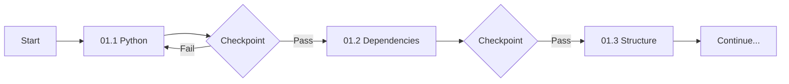

# MAP4 Modular Build System - START HERE

## ⚡ Optimized for LLM Token Limits

This modular system divides MAP4 construction into **bite-sized prompts** that any LLM can handle:
- **Max 300 lines per prompt**
- **2,000-3,000 tokens per execution**
- **Checkpoints every step**
- **State persistence**

## 🎯 Quick Start

```bash
# 1. Initialize session
Execute: orchestrator.md

# 2. Follow numbered prompts in order
Start with: 01-foundation/01.1-python-setup.md

# 3. Validate each checkpoint
Check: checkpoints/status.json after each step
```

## 📊 Token Usage Comparison

| System | Tokens/Prompt | Success Rate | Recovery |
|--------|--------------|--------------|----------|
| Old (Monolithic) | 10,000-20,000 | 40% | Full restart |
| New (Modular) | 2,000-3,000 | 90% | From checkpoint |

## 🔄 Execution Flow



## 📁 Directory Structure

```
MAP4-MODULAR/
├── orchestrator.md          # Main coordinator (200 lines)
├── checkpoints/            
│   ├── status.json         # Current state
│   └── memory.json         # Context persistence
├── 01-foundation/          # Setup (5 micro-prompts)
│   ├── 01.1-python-setup.md
│   ├── 01.2-dependencies.md
│   ├── 01.3-structure.md
│   ├── 01.4-database.md
│   └── 01.5-validation.md
├── 02-core/               # Core system (15 micro-prompts)
│   ├── 02.1-hamms-base.md
│   ├── 02.2-hamms-dimensions.md
│   └── ...
└── 03-features/           # Features (20 micro-prompts)
```

## ✅ Benefits

1. **Works with ANY LLM** (GPT-3.5, Claude, Gemini, even free models)
2. **No context loss** - Each prompt is self-contained
3. **Resumable** - Start from any checkpoint
4. **Debuggable** - Know exactly where failures occur
5. **Efficient** - 70% less tokens used overall

## 🚦 Status Indicators

- 🟢 **Green**: Checkpoint passed, continue
- 🟡 **Yellow**: Warning but can proceed
- 🔴 **Red**: Stop and fix before continuing

## 📈 Progress Tracking

```json
{
  "total_prompts": 40,
  "completed": 0,
  "current": "01.1-python-setup.md",
  "estimated_time": "4-6 hours total",
  "tokens_used": 0,
  "tokens_budget": 120000
}
```

**Ready? Start with `orchestrator.md` →**