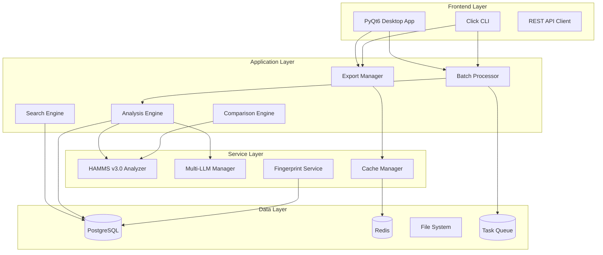

# MAP4 Technical Requirements - Architecture & Infrastructure

## System Architecture Overview



## Core Technology Stack

### Programming Languages
- **Python 3.8+**: Core application logic
- **SQL**: Database queries and stored procedures
- **JavaScript/TypeScript**: Future web interface (optional)

### Frameworks & Libraries

#### Backend Core
```yaml
Core:
  - Python: ">=3.8,<3.12"
  - asyncio: "Built-in async/await support"
  - typing: "Type hints for better code quality"

Audio Processing:
  - librosa: ">=0.10.1"  # Audio analysis
  - soundfile: ">=0.12.1"  # Audio I/O
  - pydub: ">=0.25.1"  # Format conversion
  - chromaprint: ">=1.5.0"  # Audio fingerprinting
  - essentia: ">=2.1b6"  # Advanced audio features (optional)

Data Processing:
  - numpy: ">=1.24.0"  # Numerical operations
  - scipy: ">=1.10.0"  # Scientific computing
  - pandas: ">=2.0.0"  # Data manipulation
  - scikit-learn: ">=1.3.0"  # ML algorithms

Database:
  - sqlalchemy: ">=2.0.0"  # ORM
  - alembic: ">=1.12.0"  # Migrations
  - psycopg2: ">=2.9.0"  # PostgreSQL driver
  - redis: ">=5.0.0"  # Cache client

LLM Integration:
  - openai: ">=1.0.0"
  - anthropic: ">=0.8.0"
  - google-generativeai: ">=0.3.0"
  - langchain: ">=0.1.0"  # Optional: LLM orchestration

Export & Reports:
  - reportlab: ">=4.0.0"  # PDF generation
  - openpyxl: ">=3.1.0"  # Excel files
  - jinja2: ">=3.1.0"  # Template engine
  - matplotlib: ">=3.7.0"  # Charts
  - plotly: ">=5.17.0"  # Interactive visualizations

UI Frameworks:
  - PyQt6: ">=6.5.0"  # Desktop GUI
  - click: ">=8.1.0"  # CLI framework
  - rich: ">=13.0.0"  # Terminal formatting

Testing & Quality:
  - pytest: ">=7.4.0"
  - pytest-asyncio: ">=0.21.0"
  - pytest-cov: ">=4.1.0"
  - black: ">=23.0.0"
  - mypy: ">=1.5.0"
  - ruff: ">=0.1.0"

Monitoring:
  - sentry-sdk: ">=1.35.0"
  - prometheus-client: ">=0.19.0"
  - structlog: ">=23.2.0"
```

## Infrastructure Requirements

### Development Environment
```yaml
Minimum:
  CPU: "4 cores"
  RAM: "8 GB"
  Storage: "50 GB SSD"
  OS: "Windows 10/11, macOS 11+, Ubuntu 20.04+"

Recommended:
  CPU: "8+ cores"
  RAM: "16 GB"
  Storage: "100 GB SSD"
  GPU: "Optional: CUDA-capable for ML acceleration"
```

### Production Environment
```yaml
Application Server:
  CPU: "8-16 cores"
  RAM: "32 GB"
  Storage: "500 GB SSD"
  Network: "1 Gbps"

Database Server:
  CPU: "8 cores"
  RAM: "16 GB"
  Storage: "1 TB SSD (RAID 1)"
  Backup: "Daily snapshots"

Cache Server:
  CPU: "4 cores"
  RAM: "8 GB"
  Storage: "100 GB SSD"
```

## Database Design

### PostgreSQL Schema
```sql
-- Core tables
CREATE TABLE tracks (
    id SERIAL PRIMARY KEY,
    file_path VARCHAR(500) UNIQUE NOT NULL,
    file_hash VARCHAR(64) NOT NULL,
    file_size BIGINT,
    
    -- Metadata
    title VARCHAR(255),
    artist VARCHAR(255),
    album VARCHAR(255),
    genre VARCHAR(100),
    year INTEGER,
    
    -- Audio features
    duration FLOAT,
    sample_rate INTEGER,
    bit_rate INTEGER,
    channels INTEGER,
    
    -- Analysis results
    bpm FLOAT,
    key VARCHAR(10),
    energy FLOAT,
    
    -- HAMMS v3.0
    hamms_vector JSONB,
    hamms_confidence FLOAT,
    
    -- AI Analysis
    ai_analysis JSONB,
    ai_provider VARCHAR(50),
    ai_analyzed_at TIMESTAMP,
    
    -- Fingerprints
    chromaprint_fp TEXT,
    spectral_hash VARCHAR(128),
    
    -- Timestamps
    created_at TIMESTAMP DEFAULT CURRENT_TIMESTAMP,
    updated_at TIMESTAMP DEFAULT CURRENT_TIMESTAMP,
    analyzed_at TIMESTAMP,
    
    -- Full-text search
    search_vector tsvector GENERATED ALWAYS AS (
        to_tsvector('english', 
            coalesce(title, '') || ' ' || 
            coalesce(artist, '') || ' ' || 
            coalesce(album, '') || ' ' || 
            coalesce(genre, '')
        )
    ) STORED
);

-- Indexes for performance
CREATE INDEX idx_tracks_bpm ON tracks(bpm);
CREATE INDEX idx_tracks_key ON tracks(key);
CREATE INDEX idx_tracks_genre ON tracks(genre);
CREATE INDEX idx_tracks_artist ON tracks(artist);
CREATE INDEX idx_tracks_search ON tracks USING GIN(search_vector);
CREATE INDEX idx_tracks_hamms ON tracks USING GIN(hamms_vector);

-- Playlists
CREATE TABLE playlists (
    id SERIAL PRIMARY KEY,
    name VARCHAR(255) NOT NULL,
    description TEXT,
    created_at TIMESTAMP DEFAULT CURRENT_TIMESTAMP,
    updated_at TIMESTAMP DEFAULT CURRENT_TIMESTAMP
);

-- Playlist tracks
CREATE TABLE playlist_tracks (
    id SERIAL PRIMARY KEY,
    playlist_id INTEGER REFERENCES playlists(id) ON DELETE CASCADE,
    track_id INTEGER REFERENCES tracks(id) ON DELETE CASCADE,
    position INTEGER NOT NULL,
    transition_quality FLOAT,
    UNIQUE(playlist_id, position)
);

-- Analysis queue
CREATE TABLE analysis_queue (
    id SERIAL PRIMARY KEY,
    file_path VARCHAR(500) NOT NULL,
    priority INTEGER DEFAULT 5,
    status VARCHAR(20) DEFAULT 'pending',
    error_message TEXT,
    created_at TIMESTAMP DEFAULT CURRENT_TIMESTAMP,
    started_at TIMESTAMP,
    completed_at TIMESTAMP
);

-- Export history
CREATE TABLE export_history (
    id SERIAL PRIMARY KEY,
    export_type VARCHAR(20) NOT NULL,
    track_count INTEGER,
    file_size BIGINT,
    duration_ms INTEGER,
    user_id VARCHAR(100),
    created_at TIMESTAMP DEFAULT CURRENT_TIMESTAMP
);
```

### Redis Cache Structure
```yaml
Cache Keys:
  # Track analysis results
  track:{file_hash}: "Complete track analysis"
  hamms:{file_hash}: "HAMMS vector only"
  ai:{file_hash}:{provider}: "AI analysis by provider"
  
  # Search results
  search:{query_hash}: "Search results"
  filter:{filter_hash}: "Filtered results"
  
  # Statistics
  stats:library: "Library statistics"
  stats:genre:{genre}: "Genre statistics"
  
  # Temporary
  export:{job_id}: "Export job status"
  batch:{job_id}: "Batch processing status"

TTL Configuration:
  track_analysis: 86400  # 24 hours
  search_results: 3600   # 1 hour
  statistics: 300        # 5 minutes
  temporary: 600         # 10 minutes
```

## API Design

### RESTful Endpoints
```yaml
Tracks:
  GET /api/tracks: "List all tracks with pagination"
  GET /api/tracks/{id}: "Get single track details"
  POST /api/tracks/analyze: "Submit track for analysis"
  PUT /api/tracks/{id}: "Update track metadata"
  DELETE /api/tracks/{id}: "Delete track"

Batch:
  POST /api/batch/analyze: "Submit batch for analysis"
  GET /api/batch/{job_id}: "Get batch job status"
  DELETE /api/batch/{job_id}: "Cancel batch job"

Search:
  GET /api/search: "Full-text search"
  POST /api/search/advanced: "Advanced multi-parameter search"

Export:
  POST /api/export/pdf: "Generate PDF report"
  POST /api/export/excel: "Generate Excel export"
  POST /api/export/json: "Generate JSON export"
  GET /api/export/{job_id}: "Get export status"

Comparison:
  POST /api/compare: "Compare multiple tracks"
  GET /api/compatibility/{track1_id}/{track2_id}: "Get compatibility score"

Statistics:
  GET /api/stats/library: "Library statistics"
  GET /api/stats/genres: "Genre distribution"
  GET /api/stats/timeline: "Timeline analysis"
```

## Security Requirements

### Authentication & Authorization
```yaml
Authentication:
  - Local user accounts with bcrypt hashing
  - Optional: OAuth2 integration (Google, GitHub)
  - Session management with secure cookies
  - JWT tokens for API access

Authorization:
  - Role-based access control (RBAC)
  - Roles: Admin, User, Viewer
  - API rate limiting per user
  - File access restrictions
```

### Data Protection
```yaml
Encryption:
  - TLS 1.3 for all network communication
  - Encryption at rest for sensitive data
  - API keys stored in environment variables
  - Secure password storage (bcrypt)

Privacy:
  - No telemetry without consent
  - Local-first data storage
  - GDPR compliance for EU users
  - Data export functionality
```

## Performance Requirements

### Response Time Targets
```yaml
User Interface:
  - Page load: < 500ms
  - Search response: < 100ms
  - Track analysis start: < 1s
  - Export generation start: < 2s

Batch Processing:
  - Single track analysis: < 2s
  - 100 tracks: < 30s
  - 1000 tracks: < 5 minutes
  - 10000 tracks: < 30 minutes

API Response:
  - GET requests: < 200ms
  - POST requests: < 500ms
  - Search queries: < 100ms
  - Export generation: < 5s for 1000 tracks
```

### Scalability Targets
```yaml
Concurrent Users:
  - Development: 1-5 users
  - Production: 50-100 users
  - Enterprise: 500+ users

Data Volume:
  - Small library: < 1,000 tracks
  - Medium library: 1,000-10,000 tracks
  - Large library: 10,000-100,000 tracks
  - Enterprise: 100,000+ tracks

Processing Throughput:
  - Sequential: 60 tracks/minute
  - Parallel (4 cores): 240 tracks/minute
  - Parallel (8 cores): 480 tracks/minute
  - Distributed: 1000+ tracks/minute
```

## Monitoring & Observability

### Logging
```python
# Structured logging configuration
LOGGING_CONFIG = {
    'version': 1,
    'formatters': {
        'json': {
            'class': 'pythonjsonlogger.jsonlogger.JsonFormatter',
            'format': '%(asctime)s %(name)s %(levelname)s %(message)s'
        }
    },
    'handlers': {
        'console': {
            'class': 'logging.StreamHandler',
            'formatter': 'json',
            'level': 'INFO'
        },
        'file': {
            'class': 'logging.handlers.RotatingFileHandler',
            'filename': 'logs/map4.log',
            'maxBytes': 10485760,  # 10MB
            'backupCount': 5,
            'formatter': 'json',
            'level': 'DEBUG'
        }
    },
    'root': {
        'level': 'INFO',
        'handlers': ['console', 'file']
    }
}
```

### Metrics
```yaml
Application Metrics:
  - Tracks analyzed per minute
  - Cache hit rate
  - API response times
  - Error rates by component
  - Queue depth and processing time

System Metrics:
  - CPU utilization
  - Memory usage
  - Disk I/O
  - Network throughput
  - Database connections

Business Metrics:
  - Daily active users
  - Tracks analyzed per user
  - Export usage by type
  - Feature adoption rates
```

## Development Tools

### CI/CD Pipeline
```yaml
# .github/workflows/ci.yml
name: CI/CD Pipeline

on:
  push:
    branches: [main, develop]
  pull_request:
    branches: [main]

jobs:
  test:
    runs-on: ubuntu-latest
    steps:
      - uses: actions/checkout@v3
      - uses: actions/setup-python@v4
        with:
          python-version: '3.10'
      - run: pip install -r requirements.txt
      - run: pytest tests/ --cov=src --cov-report=xml
      - run: black --check src/
      - run: mypy src/
      - run: ruff src/

  build:
    needs: test
    runs-on: ubuntu-latest
    steps:
      - uses: actions/checkout@v3
      - run: docker build -t map4:latest .
      - run: docker save map4:latest | gzip > map4.tar.gz
      - uses: actions/upload-artifact@v3
        with:
          name: docker-image
          path: map4.tar.gz
```

## Deployment Configuration

### Docker Setup
```dockerfile
# Dockerfile
FROM python:3.10-slim

WORKDIR /app

# Install system dependencies
RUN apt-get update && apt-get install -y \
    ffmpeg \
    libpq-dev \
    gcc \
    && rm -rf /var/lib/apt/lists/*

# Install Python dependencies
COPY requirements.txt .
RUN pip install --no-cache-dir -r requirements.txt

# Copy application
COPY src/ ./src/
COPY config/ ./config/

# Create non-root user
RUN useradd -m -u 1000 map4 && chown -R map4:map4 /app
USER map4

# Run application
CMD ["python", "-m", "src.main"]
```

### Kubernetes Deployment
```yaml
# k8s/deployment.yaml
apiVersion: apps/v1
kind: Deployment
metadata:
  name: map4
spec:
  replicas: 3
  selector:
    matchLabels:
      app: map4
  template:
    metadata:
      labels:
        app: map4
    spec:
      containers:
      - name: map4
        image: map4:latest
        ports:
        - containerPort: 8000
        env:
        - name: DATABASE_URL
          valueFrom:
            secretKeyRef:
              name: map4-secrets
              key: database-url
        resources:
          requests:
            memory: "1Gi"
            cpu: "500m"
          limits:
            memory: "2Gi"
            cpu: "1000m"
```

---

**Document Version:** 1.0.0
**Last Updated:** 2024-12
**Next Review:** Q1 2025
**Owner:** Architecture Team