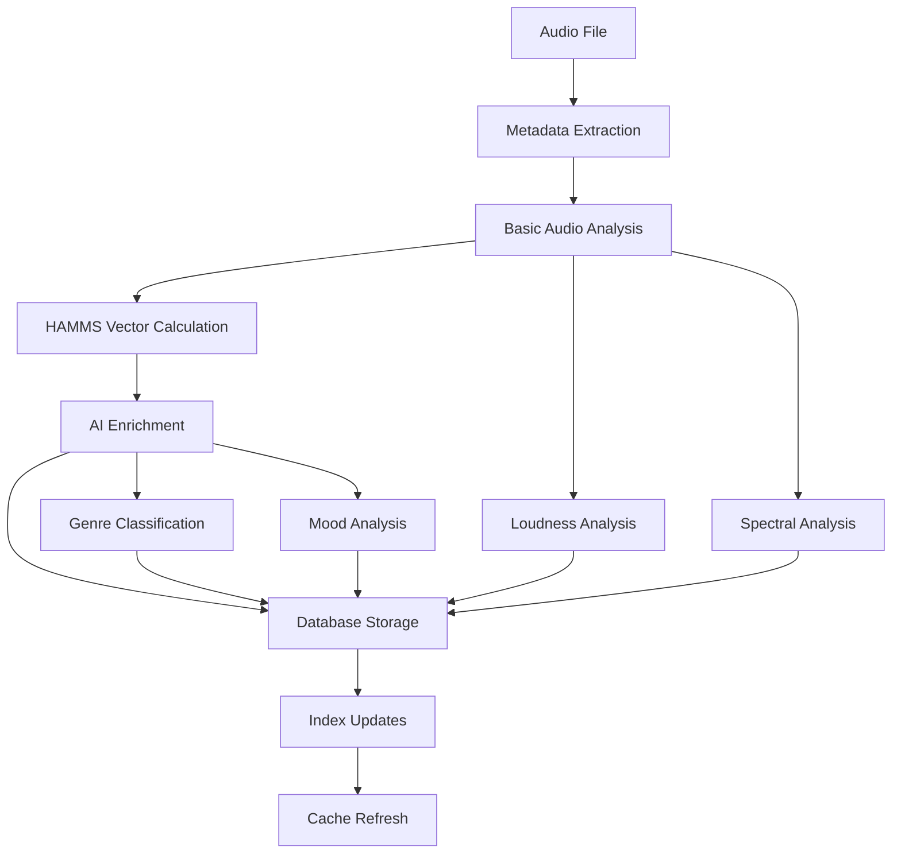
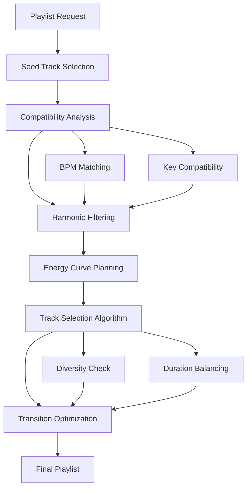
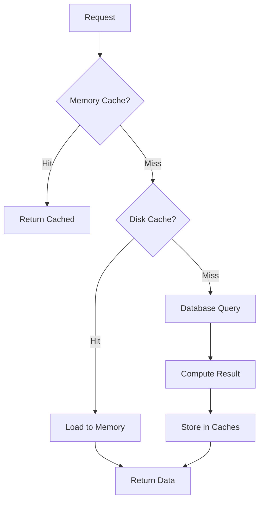

# Music Analyzer Pro - Documentación Técnica Completa

## 📋 Índice
- [Visión General](#visión-general)
- [Arquitectura del Sistema](#arquitectura-del-sistema)
- [Stack Tecnológico](#stack-tecnológico)
- [Estructura del Proyecto](#estructura-del-proyecto)
- [Base de Datos](#base-de-datos)
- [Algoritmos y Procesamiento](#algoritmos-y-procesamiento)
- [Flujos de Trabajo](#flujos-de-trabajo)
- [API y Servicios](#api-y-servicios)
- [Interfaz de Usuario](#interfaz-de-usuario)
- [Sistema de Análisis](#sistema-de-análisis)
- [Generación de Playlists](#generación-de-playlists)
- [Configuración](#configuración)
- [Despliegue](#despliegue)
- [Testing](#testing)
- [Desarrollo](#desarrollo)

## 🎯 Visión General

### Propósito
Music Analyzer Pro es una aplicación profesional de análisis musical diseñada para DJs, productores musicales y entusiastas de la música. Combina análisis técnico avanzado, inteligencia artificial y gestión de bibliotecas musicales en una plataforma integrada.

### Características Principales
- **Análisis Audio Avanzado**: BPM, clave musical, energía, características tímbricas
- **HAMMS v3.0**: Sistema de análisis harmónico multidimensional (12 dimensiones)
- **Inteligencia Artificial**: Clasificación de géneros, análisis de mood, enriquecimiento de metadatos
- **Generación de Playlists**: Algoritmos inteligentes basados en compatibilidad harmónica
- **Compatibilidad MixedInKey**: Importación y normalización de datos
- **Análisis de Loudness**: Estándares profesionales de mastering
- **Visualización en Tiempo Real**: VU meters, espectrogramas, análisis dinámico

### Casos de Uso
1. **Análisis de Biblioteca Musical**: Procesamiento batch de colecciones completas
2. **Preparación para DJ Sets**: Análisis de compatibilidad y generación de transiciones
3. **Control de Calidad de Audio**: Análisis de loudness y características técnicas
4. **Investigación Musical**: Clustering y análisis de similitudes
5. **Workflow de Producción**: Integración con DAWs y herramientas profesionales

## 🏗️ Arquitectura del Sistema

### Patrón Arquitectónico
```
┌─────────────────┐    ┌─────────────────┐    ┌─────────────────┐
│   Presentation  │────│    Business     │────│   Data Access   │
│      Layer      │    │     Logic       │    │     Layer       │
├─────────────────┤    ├─────────────────┤    ├─────────────────┤
│ • PyQt6 UI      │    │ • Audio Analysis│    │ • SQLite DB     │
│ • Visualizers   │    │ • AI Processing │    │ • File System   │
│ • Controls      │    │ • HAMMS Engine  │    │ • Cache Layer   │
│ • Real-time     │    │ • Playlist Gen  │    │ • Config Store  │
└─────────────────┘    └─────────────────┘    └─────────────────┘
```

### Componentes Principales

#### Core Engine
- **Audio Analyzer**: Procesamiento de señales y extracción de características
- **HAMMS Analyzer**: Sistema de análisis harmónico multidimensional
- **Database Manager**: Gestión centralizada de datos con patrón singleton
- **Config Manager**: Manejo de configuración distribuida

#### Processing Pipeline
```
Audio File → Metadata Extract → Audio Analysis → AI Enrichment → Database Storage
     ↓              ↓               ↓              ↓              ↓
  File Info    Basic Metadata   Technical Data   Semantic Info   Persistence
```

#### Agent System
- **Agent Orchestrator**: Coordinación de tareas asíncronas
- **Audio Analysis Agent**: Procesamiento especializado de audio
- **Database Optimization Agent**: Mantenimiento y optimización
- **UI Enhancement Agent**: Mejoras dinámicas de interfaz

## 💻 Stack Tecnológico

### Lenguajes y Frameworks
```yaml
Core Language: Python 3.11+
GUI Framework: PyQt6 (6.5.0+)
Audio Processing: 
  - librosa (0.10.0+)
  - soundfile (0.12.0+)
  - pygame (2.5.0+)
  - python-vlc (3.0.0+)
Database: SQLite 3 with SQLAlchemy (2.0.0+)
AI/ML:
  - OpenAI GPT-4 API
  - scikit-learn (1.3.0+)
  - numpy (1.24.0+)
  - scipy (1.10.0+)
```

### Dependencias Críticas
```python
# Core Qt Framework
PyQt6>=6.5.0
PyQt6-Qt6>=6.5.0
PyQt6-sip>=13.5.0

# Audio Processing
librosa>=0.10.0
soundfile>=0.12.0
pydub>=0.25.1
pygame>=2.5.0
python-vlc>=3.0.0

# Scientific Computing
numpy>=1.24.0
scipy>=1.10.0
scikit-learn>=1.3.0

# Database
SQLAlchemy>=2.0.0
alembic>=1.12.0

# Visualization
pyqtgraph>=0.13.0
matplotlib>=3.7.0

# AI Integration
openai>=1.0.0

# Performance
numba>=0.58.0
cython>=3.0.0
```

### Arquitectura de Servicios
```
┌──────────────────┐
│   Web API Layer │ (FastAPI 0.109.0)
├──────────────────┤
│ Background Tasks │ (Async/Threading)
├──────────────────┤
│  Cache Layer     │ (Redis 5.0.1)
├──────────────────┤
│  Core Services   │ (Python Modules)
├──────────────────┤
│   Data Layer     │ (SQLite + Files)
└──────────────────┘
```

## 📁 Estructura del Proyecto

### Organización de Directorios
```
music-analyzer-pro/
├── src/                        # Código fuente principal
│   ├── core/                   # Lógica de negocio central
│   ├── models/                 # Modelos de datos
│   ├── ui/                     # Interfaces de usuario
│   │   ├── components/         # Componentes reutilizables
│   │   ├── dialogs/           # Diálogos modales
│   │   └── widgets/           # Widgets personalizados
│   ├── audio/                  # Procesamiento de audio
│   ├── ai_analysis/           # Análisis con IA
│   │   ├── classifier.py       # Clasificadores ML
│   │   ├── metadata_enrichment_openai.py
│   │   ├── genre_classifier.py
│   │   ├── mood_analyzer.py
│   │   └── lyrics_analyzer.py
│   ├── playlist_generation/    # Generación de playlists
│   │   ├── harmonic_engine.py  # Motor harmónico
│   │   ├── scoring_engine.py   # Sistema de puntuación
│   │   └── advanced_flows.py   # Flujos avanzados
│   ├── agents/                # Sistema de agentes
│   ├── analytics/             # Métricas y telemetría
│   ├── search/               # Funcionalidad de búsqueda
│   ├── telemetry/            # Monitoreo de rendimiento
│   └── utils/                # Utilidades compartidas
├── tests/                     # Suite de pruebas
│   ├── unit/                 # Pruebas unitarias
│   ├── integration/          # Pruebas de integración
│   └── fixtures/             # Datos de prueba
├── resources/                # Assets estáticos
├── packaging/               # Scripts de empaquetado
├── scripts/                # Scripts de utilidad
├── docs/                   # Documentación
├── prompts/               # Prompts para IA
└── PR/                   # Templates de Pull Request
```

### Módulos Principales

#### `src/music_player.py` (46,676 líneas)
**Aplicación principal con interfaz gráfica completa**
- Reproductor de música integrado
- Visualizaciones en tiempo real
- Gestión de biblioteca musical
- Interfaz de análisis HAMMS
- Integración con servicios de IA

#### `src/database.py` (1,170 líneas)
**Sistema de gestión de base de datos**
```python
class MusicDatabase:
    """SQLite database handler for music library"""
    
    def __init__(self, db_path=None):
        # Centralized database configuration
        # WAL mode for concurrency
        # Foreign key constraints enabled
```

**Tablas principales:**
- `tracks`: Metadata de pistas musicales
- `ai_analysis`: Análisis de IA por pista
- `hamms_advanced`: Datos HAMMS v3.0
- `playlists`: Gestión de playlists
- `playlist_tracks`: Relaciones playlist-track
- `loudness_analysis`: Métricas de loudness
- `similar_tracks`: Matriz de similitud
- `track_clusters`: Agrupaciones inteligentes

#### `src/hamms_analyzer.py` (943 líneas)
**Sistema HAMMS v3.0 - Análisis Harmónico Multidimensional**
```python
class HAMMSAnalyzer:
    """HAMMS v3.0 12-dimensional vector analysis system"""
    
    DIMENSION_WEIGHTS = {
        'bpm': 1.3,
        'key': 1.4,
        'energy': 1.2,
        'danceability': 0.9,
        'valence': 0.8,
        'acousticness': 0.6,
        'instrumentalness': 0.5,
        'rhythmic_pattern': 1.1,
        'spectral_centroid': 0.7,
        'tempo_stability': 0.9,
        'harmonic_complexity': 0.8,
        'dynamic_range': 0.6
    }
```

#### `map_analyzer.py` (387 líneas)
**Orquestador de análisis modular**
- Análisis automático de código
- Detección de patrones problemáticos
- Generación de reportes
- Sistema de correcciones incrementales

## 🗄️ Base de Datos

### Esquema Principal

#### Tabla `tracks`
```sql
CREATE TABLE tracks (
    id INTEGER PRIMARY KEY AUTOINCREMENT,
    file_path TEXT UNIQUE NOT NULL,
    
    -- Basic metadata
    title TEXT,
    artist TEXT,
    album TEXT,
    album_artist TEXT,
    genre TEXT,
    year INTEGER,
    track_number INTEGER,
    
    -- DJ/Production metadata
    bpm REAL,
    initial_key TEXT,
    camelot_key TEXT,        -- Computed Camelot code
    energy_level INTEGER,    -- 1-10 scale
    cuepoints TEXT,          -- JSON array
    comment TEXT,
    
    -- Audio properties
    duration REAL,
    bitrate INTEGER,
    sample_rate INTEGER,
    channels INTEGER,
    codec TEXT,
    file_size INTEGER,
    
    -- Statistics
    play_count INTEGER DEFAULT 0,
    skip_count INTEGER DEFAULT 0,
    rating INTEGER DEFAULT 0,
    last_played TIMESTAMP,
    
    -- Artwork
    artwork_data BLOB,
    artwork_path TEXT,
    
    -- Enhanced features
    danceability REAL,
    valence REAL,
    acousticness REAL,
    instrumentalness REAL,
    tempo_stability REAL,
    analysis_source TEXT,    -- 'mixedinkey', 'hamms', 'manual'
    source_confidence REAL   -- 0.95 for MixedInKey, 0.7 for calculated
);
```

#### Tabla `hamms_advanced`
```sql
CREATE TABLE hamms_advanced (
    track_id INTEGER PRIMARY KEY,
    vector_12d TEXT,              -- JSON: 12-dimensional feature vector
    vector_pca TEXT,              -- JSON: PCA-reduced representation
    rhythmic_pattern TEXT,        -- JSON: Rhythm analysis
    spectral_features TEXT,       -- JSON: Spectral characteristics
    tempo_stability REAL,
    harmonic_complexity REAL,
    dynamic_range REAL,
    energy_curve TEXT,            -- JSON: Energy progression
    transition_points TEXT,       -- JSON: Mix points
    genre_cluster INTEGER,
    ml_confidence REAL,
    source_confidence REAL,
    created_at TIMESTAMP DEFAULT CURRENT_TIMESTAMP,
    FOREIGN KEY (track_id) REFERENCES tracks(id)
);
```

#### Tabla `ai_analysis`
```sql
CREATE TABLE ai_analysis (
    track_id INTEGER PRIMARY KEY,
    genre TEXT,
    subgenre TEXT,
    mood TEXT,
    era TEXT,
    year_estimate INTEGER,
    tags TEXT,                   -- JSON array
    structure TEXT,              -- JSON: Song structure
    quality_metrics TEXT,        -- JSON: Audio quality metrics
    context_tags TEXT,          -- JSON: Contextual tags
    language TEXT,
    explicit INTEGER DEFAULT 0,
    energy_profile TEXT,        -- JSON: Detailed energy analysis
    similar_tracks TEXT,        -- JSON: Similar track IDs
    ai_version TEXT,
    analysis_date TIMESTAMP DEFAULT CURRENT_TIMESTAMP,
    FOREIGN KEY (track_id) REFERENCES tracks(id)
);
```

### Índices de Rendimiento
```sql
-- Primary search indices
CREATE INDEX idx_tracks_artist ON tracks(artist);
CREATE INDEX idx_tracks_album ON tracks(album);
CREATE INDEX idx_tracks_title ON tracks(title);
CREATE INDEX idx_tracks_camelot ON tracks(camelot_key);
CREATE INDEX idx_tracks_bpm ON tracks(bpm);

-- Composite indices for complex queries
CREATE INDEX idx_tracks_artist_title ON tracks(artist, title);
CREATE INDEX idx_ai_genre_mood ON ai_analysis(genre, mood);

-- Performance indices
CREATE INDEX idx_similar_distance ON similar_tracks(track_id, distance);
CREATE INDEX idx_loudness_track ON loudness_analysis(track_id);
```

### Patrones de Acceso
1. **Single Writer Pattern**: Un único hilo de escritura previene corruption
2. **WAL Mode**: Write-Ahead Logging para mejor concurrencia
3. **Connection Pooling**: Reutilización de conexiones para performance
4. **Lazy Loading**: Carga de datos bajo demanda en la UI
5. **Batch Operations**: Operaciones masivas optimizadas

## ⚙️ Algoritmos y Procesamiento

### HAMMS v3.0 - Análisis Multidimensional

#### Vector de 12 Dimensiones
```python
def calculate_extended_vector(self, track_data: Dict) -> np.ndarray:
    """Calculate 12-dimensional HAMMS vector for a track"""
    
    # Core dimensions (normalized to [0,1])
    norm_bpm = np.clip((bpm - 60) / 140, 0, 1)
    norm_key = self.camelot_to_numeric(key)
    norm_energy = energy if energy <= 1.0 else energy / 10
    
    # Calculate extended features
    rhythmic_pattern = self.calculate_rhythmic_pattern(genre, bpm)
    spectral_centroid = self.calculate_spectral_centroid(genre, energy)
    tempo_stability = track_data.get('tempo_stability', 0.7)
    harmonic_complexity = self.calculate_harmonic_complexity(key)
    dynamic_range = self.calculate_dynamic_range(genre)
    
    return np.array([
        norm_bpm,                # BPM normalized
        norm_key,               # Camelot wheel position
        norm_energy,            # Energy level
        danceability,           # Danceability factor
        valence,                # Musical positivity
        acousticness,           # Acoustic vs electronic
        instrumentalness,       # Vocal vs instrumental
        rhythmic_pattern,       # Rhythm complexity
        spectral_centroid,      # Brightness/timbre
        tempo_stability,        # Tempo consistency
        harmonic_complexity,    # Key complexity
        dynamic_range          # Dynamic variation
    ])
```

#### Cálculo de Similitud
```python
def calculate_similarity(self, vector1: np.ndarray, vector2: np.ndarray) -> Dict:
    """Calculate similarity between two HAMMS vectors"""
    
    # Apply dimension weights
    weights = np.array(list(self.DIMENSION_WEIGHTS.values()))
    weighted_v1 = vector1 * weights
    weighted_v2 = vector2 * weights
    
    # Euclidean distance
    euclidean_dist = np.linalg.norm(weighted_v1 - weighted_v2)
    max_distance = np.linalg.norm(weights)
    euclidean_sim = 1 - (euclidean_dist / max_distance)
    
    # Cosine similarity
    cosine_sim = np.dot(weighted_v1, weighted_v2) / (
        np.linalg.norm(weighted_v1) * np.linalg.norm(weighted_v2)
    )
    
    # Overall similarity (weighted average)
    overall_similarity = euclidean_sim * 0.6 + cosine_sim * 0.4
    
    return {
        'overall': overall_similarity,
        'euclidean': euclidean_sim,
        'cosine': cosine_sim
    }
```

### Análisis de Compatibilidad para Mixing

#### Algoritmo de Compatibilidad Harmónica
```python
def calculate_mix_compatibility(self, track1_data: Dict, track2_data: Dict) -> Dict:
    """Calculate detailed mix compatibility between two tracks"""
    
    # BPM compatibility (±8% tolerance)
    bpm_ratio = min(bpm1, bpm2) / max(bpm1, bpm2)
    bpm_compatible = bpm_ratio > 0.92
    
    # Harmonic compatibility (Camelot Wheel)
    harmonic_distance = self.calculate_harmonic_distance(key1, key2)
    harmonic_compatible = harmonic_distance <= 1
    
    # Energy compatibility
    energy_diff = abs(energy1 - energy2)
    energy_compatible = energy_diff <= 0.3
    
    # Overall compatibility score
    compatibility_score = (
        bmp_score * 0.4 +
        harmonic_score * 0.4 +
        energy_score * 0.2
    )
    
    return {
        'compatibility_score': compatibility_score,
        'transition_type': transition_type,
        'optimal_transition': optimal_transition,
        'rating': rating
    }
```

#### Rueda de Camelot
```python
CAMELOT_WHEEL = {
    'C': '8B', 'Am': '8A',
    'G': '9B', 'Em': '9A',
    'D': '10B', 'Bm': '10A',
    'A': '11B', 'F#m': '11A',
    'E': '12B', 'C#m': '12A',
    'B': '1B', 'G#m': '1A',
    'Gb': '2B', 'Ebm': '2A',
    'Db': '3B', 'Bbm': '3A',
    'Ab': '4B', 'Fm': '4A',
    'Eb': '5B', 'Cm': '5A',
    'Bb': '6B', 'Gm': '6A',
    'F': '7B', 'Dm': '7A'
}
```

### Análisis con Inteligencia Artificial

#### Enriquecimiento de Metadata con OpenAI
```python
class MetadataEnrichmentOpenAI:
    """Complete metadata enrichment using OpenAI GPT-4"""
    
    def enrich_track(self, track_data: Dict, hamms_data: Dict) -> Dict:
        """Enrich track with AI analysis"""
        
        prompt = self._build_analysis_prompt(track_data, hamms_data)
        
        try:
            response = self.client.chat.completions.create(
                model=self.model,
                messages=[
                    {"role": "system", "content": self.system_prompt},
                    {"role": "user", "content": prompt}
                ],
                temperature=0.1,  # Low temperature for consistency
                max_tokens=1000
            )
            
            return self._parse_ai_response(response.choices[0].message.content)
            
        except Exception as e:
            logger.error(f"OpenAI enrichment failed: {e}")
            return self._fallback_analysis(track_data)
```

### Motor de Armonías para Playlists

#### Compatibilidad de Claves Musicales
```python
class HarmonicEngine:
    """Engine for harmonic and BPM compatibility calculations"""
    
    @lru_cache(maxsize=256)
    def compatibles(self, camelot_key: str, mode: str = 'perfect_good') -> List[str]:
        """Get compatible keys based on Camelot Wheel rules"""
        
        compatible_keys = []
        
        # Always include same key
        compatible_keys.append(key)
        
        # Perfect matches: ±1 on the wheel
        prev_num = 12 if num == 1 else num - 1
        next_num = 1 if num == 12 else num + 1
        
        compatible_keys.extend([
            f"{prev_num}{letter}",
            f"{next_num}{letter}"
        ])
        
        # Relative major/minor
        relative_letter = 'B' if letter == 'A' else 'A'
        compatible_keys.append(f"{num}{relative_letter}")
        
        if mode in ['good', 'perfect_good']:
            # Good matches: ±2 on wheel
            prev2_num = 11 if num <= 2 else num - 2
            next2_num = num + 2 if num <= 10 else num - 10
            
            compatible_keys.extend([
                f"{prev2_num}{letter}",
                f"{next2_num}{letter}"
            ])
        
        return list(set(compatible_keys))
```

### Análisis de Loudness Profesional

#### Estándares de Mastering
```python
class LoudnessAnalyzer:
    """Professional loudness analysis following broadcast standards"""
    
    def analyze_loudness(self, audio_file: Path) -> Dict[str, float]:
        """Analyze loudness using BS.1770-4 standard"""
        
        # Load audio with proper sample rate
        y, sr = librosa.load(str(audio_file), sr=None)
        
        # Integrated loudness (LUFS)
        integrated_loudness = self._calculate_lufs(y, sr)
        
        # True peak (dBTP)
        true_peak = self._calculate_true_peak(y, sr)
        
        # Crest factor
        rms = np.sqrt(np.mean(y**2))
        peak = np.max(np.abs(y))
        crest_factor = 20 * np.log10(peak / rms) if rms > 0 else 0
        
        # Dynamic range
        dynamic_range = self._calculate_dr(y, sr)
        
        return {
            'integrated_loudness': integrated_loudness,
            'true_peak': true_peak,
            'crest_factor': crest_factor,
            'dynamic_range': dynamic_range
        }
```

## 🔄 Flujos de Trabajo

### Pipeline de Análisis de Audio



### Flujo de Generación de Playlists



### Sistema de Caché Multinivel



### Workflow de Análisis IA

```python
def ai_analysis_workflow(self, track_id: int) -> bool:
    """Complete AI analysis workflow for a track"""
    
    # 1. Get base track data
    track_data = self.db.get_track_by_id(track_id)
    if not track_data:
        return False
    
    # 2. Get HAMMS analysis (prerequisite)
    hamms_data = self.hamms.get_hamms_data(track_id)
    if not hamms_data:
        logger.warning(f"HAMMS data missing for track {track_id}")
        return False
    
    # 3. OpenAI enrichment
    if self.openai_enricher.enabled:
        ai_results = self.openai_enricher.enrich_track(track_data, hamms_data)
        if ai_results:
            self.db.save_ai_analysis(track_id, ai_results)
    
    # 4. Genre classification
    genre_result = self.genre_classifier.classify(track_data)
    if genre_result:
        self.db.update_genre_data(track_id, genre_result)
    
    # 5. Mood analysis
    mood_result = self.mood_analyzer.analyze(track_data, hamms_data)
    if mood_result:
        self.db.update_mood_data(track_id, mood_result)
    
    # 6. Similarity calculations
    self.calculate_similarities(track_id)
    
    return True
```

## 🌐 API y Servicios

### FastAPI Web API

#### Estructura de Endpoints
```python
app = FastAPI(title="Music Analyzer Pro API", version="1.0.0")

# Health check
@app.get("/health")
async def health_check():
    return {"status": "healthy", "timestamp": datetime.now()}

# Track operations
@app.get("/tracks/{track_id}")
async def get_track(track_id: int):
    return track_service.get_track_with_analysis(track_id)

@app.post("/tracks/analyze")
async def analyze_track(file_path: str):
    task_id = analysis_service.queue_analysis(file_path)
    return {"task_id": task_id, "status": "queued"}

# Playlist generation
@app.post("/playlists/generate")
async def generate_playlist(request: PlaylistRequest):
    playlist = playlist_service.generate_smart_playlist(request)
    return playlist

# Search and discovery
@app.get("/search")
async def search_tracks(
    query: str,
    genre: Optional[str] = None,
    mood: Optional[str] = None,
    bpm_range: Optional[str] = None
):
    results = search_service.search(query, genre, mood, bpm_range)
    return results
```

#### Modelos de Datos API
```python
from pydantic import BaseModel
from typing import Optional, List

class TrackResponse(BaseModel):
    id: int
    title: str
    artist: str
    album: Optional[str]
    bpm: Optional[float]
    key: Optional[str]
    camelot_key: Optional[str]
    energy_level: Optional[int]
    duration: Optional[float]
    analysis: Optional[AnalysisData]

class PlaylistRequest(BaseModel):
    duration_minutes: int
    energy_curve: str = "ascending"
    seed_tracks: Optional[List[int]] = None
    genres: Optional[List[str]] = None
    mood_target: Optional[str] = None

class AnalysisData(BaseModel):
    hamms_vector: List[float]
    ai_genre: Optional[str]
    ai_mood: Optional[str]
    compatibility_scores: Dict[str, float]
```

### Sistema de Workers Asíncronos

#### Background Task Processing
```python
from celery import Celery
from src.workers.audio_worker import AudioAnalysisWorker
from src.workers.ai_worker import AIEnrichmentWorker

# Celery app configuration
celery_app = Celery(
    'music_analyzer',
    broker='redis://localhost:6379/0',
    backend='redis://localhost:6379/0'
)

@celery_app.task(bind=True)
def analyze_audio_file(self, file_path: str):
    """Background task for audio analysis"""
    
    worker = AudioAnalysisWorker()
    
    try:
        # Update task status
        self.update_state(state='PROCESSING', meta={'progress': 0})
        
        # Basic analysis
        metadata = worker.extract_metadata(file_path)
        self.update_state(state='PROCESSING', meta={'progress': 25})
        
        # HAMMS analysis
        hamms_results = worker.analyze_hamms(file_path, metadata)
        self.update_state(state='PROCESSING', meta={'progress': 50})
        
        # Loudness analysis
        loudness_results = worker.analyze_loudness(file_path)
        self.update_state(state='PROCESSING', meta={'progress': 75})
        
        # Store results
        track_id = worker.store_results(file_path, metadata, hamms_results, loudness_results)
        self.update_state(state='PROCESSING', meta={'progress': 100})
        
        return {
            'track_id': track_id,
            'status': 'completed',
            'results': {
                'metadata': metadata,
                'hamms': hamms_results,
                'loudness': loudness_results
            }
        }
        
    except Exception as e:
        self.update_state(
            state='FAILURE',
            meta={'error': str(e), 'traceback': traceback.format_exc()}
        )
        raise
```

## 🖥️ Interfaz de Usuario

### Arquitectura PyQt6

#### Componentes Principales
```python
class MusicPlayerMainWindow(QMainWindow):
    """Main application window with integrated player and analyzer"""
    
    def __init__(self):
        super().__init__()
        
        # Core components
        self.database = MusicDatabase()
        self.hamms_analyzer = HAMMSAnalyzer()
        self.audio_player = AudioPlayer()
        
        # UI components
        self.setup_ui()
        self.setup_audio_visualizer()
        self.setup_playlist_manager()
        self.setup_analysis_dashboard()
        
    def setup_ui(self):
        """Initialize the main UI layout"""
        
        # Central widget with splitters
        central_widget = QWidget()
        self.setCentralWidget(central_widget)
        
        # Main layout
        main_layout = QHBoxLayout(central_widget)
        
        # Left panel: Library browser
        self.library_panel = LibraryBrowserWidget()
        
        # Center panel: Track details and visualizer
        self.center_panel = CenterPanelWidget()
        
        # Right panel: Playlist and analysis
        self.right_panel = RightPanelWidget()
        
        # Splitter layout
        splitter = QSplitter(Qt.Horizontal)
        splitter.addWidget(self.library_panel)
        splitter.addWidget(self.center_panel)
        splitter.addWidget(self.right_panel)
        splitter.setStretchFactor(0, 1)
        splitter.setStretchFactor(1, 2)
        splitter.setStretchFactor(2, 1)
        
        main_layout.addWidget(splitter)
```

#### Sistema de Visualización en Tiempo Real
```python
class AudioVisualizerWidget(QWidget):
    """Real-time audio visualization with multiple display modes"""
    
    def __init__(self):
        super().__init__()
        
        # Graphics view for high-performance rendering
        self.graphics_view = QGraphicsView()
        self.graphics_scene = QGraphicsScene()
        self.graphics_view.setScene(self.graphics_scene)
        
        # Visualization modes
        self.vu_meter = VUMeterWidget()
        self.spectrum_analyzer = SpectrumAnalyzerWidget()
        self.waveform_display = WaveformWidget()
        
        # Update timer
        self.update_timer = QTimer()
        self.update_timer.timeout.connect(self.update_visualizations)
        self.update_timer.start(16)  # ~60 FPS
        
    def update_visualizations(self):
        """Update all visualizations with current audio data"""
        
        if not self.audio_player.is_playing():
            return
            
        # Get current audio frame
        audio_data = self.audio_player.get_current_frame()
        if audio_data is None:
            return
        
        # Update VU meters
        left_level, right_level = self.calculate_levels(audio_data)
        self.vu_meter.update_levels(left_level, right_level)
        
        # Update spectrum
        if self.spectrum_enabled:
            spectrum_data = self.calculate_spectrum(audio_data)
            self.spectrum_analyzer.update_spectrum(spectrum_data)
        
        # Update waveform
        if self.waveform_enabled:
            self.waveform_display.update_position(self.audio_player.get_position())
```

#### VU Meter Avanzado
```python
class VUMeterWidget(QWidget):
    """Professional VU meter with peak hold and multiple modes"""
    
    def __init__(self):
        super().__init__()
        
        # Configuration
        self.display_mode = 'stereo'  # 'mono', 'stereo', 'mid_side'
        self.scale_type = 'linear'    # 'linear', 'logarithmic'
        self.peak_hold_time = 2.0     # seconds
        
        # State
        self.left_level = 0.0
        self.right_level = 0.0
        self.left_peak = 0.0
        self.right_peak = 0.0
        self.peak_hold_timer = QTimer()
        
        # Visual properties
        self.bar_width = 20
        self.bar_spacing = 5
        self.scale_marks = True
        self.peak_indicators = True
        
    def paintEvent(self, event):
        """Custom paint event for VU meter rendering"""
        
        painter = QPainter(self)
        painter.setRenderHint(QPainter.Antialiasing)
        
        # Background
        painter.fillRect(self.rect(), QColor(20, 20, 20))
        
        # Draw VU bars
        if self.display_mode == 'stereo':
            self.draw_stereo_bars(painter)
        elif self.display_mode == 'mono':
            self.draw_mono_bar(painter)
        elif self.display_mode == 'mid_side':
            self.draw_mid_side_bars(painter)
        
        # Draw scale
        if self.scale_marks:
            self.draw_scale(painter)
        
        # Draw peak indicators
        if self.peak_indicators:
            self.draw_peaks(painter)
    
    def draw_stereo_bars(self, painter):
        """Draw left and right channel VU bars"""
        
        rect = self.rect()
        bar_height = rect.height() - 40  # Leave space for labels
        
        # Left channel
        left_rect = QRect(20, 20, self.bar_width, bar_height)
        self.draw_level_bar(painter, left_rect, self.left_level, 'L')
        
        # Right channel  
        right_rect = QRect(50, 20, self.bar_width, bar_height)
        self.draw_level_bar(painter, right_rect, self.right_level, 'R')
```

### Sistema de Componentes Reutilizables

#### Widget de Análisis HAMMS
```python
class HAMMSAnalysisWidget(QWidget):
    """Interactive HAMMS analysis visualization"""
    
    def __init__(self):
        super().__init__()
        
        # Radar chart for 12-dimensional vector
        self.radar_chart = RadarChartWidget()
        
        # Dimension sliders for interactive exploration
        self.dimension_controls = {}
        for dim in HAMMSAnalyzer.DIMENSION_WEIGHTS.keys():
            slider = QSlider(Qt.Horizontal)
            slider.setRange(0, 100)
            slider.valueChanged.connect(self.update_analysis)
            self.dimension_controls[dim] = slider
        
        # Compatibility matrix
        self.compatibility_table = QTableWidget()
        
        self.setup_layout()
    
    def update_analysis(self, track_data):
        """Update visualization with new track data"""
        
        if not track_data:
            return
        
        # Calculate HAMMS vector
        hamms_vector = self.hamms_analyzer.calculate_extended_vector(track_data)
        
        # Update radar chart
        self.radar_chart.set_data(hamms_vector, list(HAMMSAnalyzer.DIMENSION_WEIGHTS.keys()))
        
        # Update dimension sliders
        for i, (dim, value) in enumerate(zip(HAMMSAnalyzer.DIMENSION_WEIGHTS.keys(), hamms_vector)):
            self.dimension_controls[dim].setValue(int(value * 100))
        
        # Find compatible tracks
        compatible_tracks = self.find_compatible_tracks(track_data)
        self.update_compatibility_table(compatible_tracks)
```

## 🎵 Sistema de Análisis

### Pipeline de Procesamiento de Audio

#### Extracción de Características
```python
class AudioAnalyzer:
    """Comprehensive audio analysis system"""
    
    def __init__(self):
        self.sample_rate = 44100
        self.hop_length = 512
        self.n_fft = 2048
        
    def analyze_audio_file(self, file_path: Path) -> Dict[str, Any]:
        """Complete audio analysis pipeline"""
        
        results = {}
        
        try:
            # Load audio
            y, sr = librosa.load(str(file_path), sr=self.sample_rate)
            results['duration'] = len(y) / sr
            results['sample_rate'] = sr
            
            # Basic features
            results.update(self.extract_basic_features(y, sr))
            
            # Tempo and rhythm
            results.update(self.analyze_tempo_rhythm(y, sr))
            
            # Harmonic analysis
            results.update(self.analyze_harmony(y, sr))
            
            # Spectral features
            results.update(self.extract_spectral_features(y, sr))
            
            # Structural analysis
            results.update(self.analyze_structure(y, sr))
            
            return results
            
        except Exception as e:
            logger.error(f"Audio analysis failed for {file_path}: {e}")
            return {}
    
    def extract_basic_features(self, y: np.ndarray, sr: int) -> Dict:
        """Extract fundamental audio features"""
        
        features = {}
        
        # RMS energy
        rms = librosa.feature.rms(y=y, hop_length=self.hop_length)[0]
        features['rms_mean'] = float(np.mean(rms))
        features['rms_std'] = float(np.std(rms))
        
        # Zero crossing rate
        zcr = librosa.feature.zero_crossing_rate(y, hop_length=self.hop_length)[0]
        features['zcr_mean'] = float(np.mean(zcr))
        
        # Spectral centroid
        spectral_centroids = librosa.feature.spectral_centroid(y=y, sr=sr)[0]
        features['spectral_centroid_mean'] = float(np.mean(spectral_centroids))
        features['spectral_centroid_std'] = float(np.std(spectral_centroids))
        
        # Spectral rolloff
        spectral_rolloff = librosa.feature.spectral_rolloff(y=y, sr=sr)[0]
        features['spectral_rolloff_mean'] = float(np.mean(spectral_rolloff))
        
        return features
    
    def analyze_tempo_rhythm(self, y: np.ndarray, sr: int) -> Dict:
        """Analyze tempo and rhythmic characteristics"""
        
        features = {}
        
        # Tempo estimation
        tempo, beats = librosa.beat.beat_track(y=y, sr=sr)
        features['tempo'] = float(tempo)
        features['beat_count'] = len(beats)
        
        # Tempo stability
        if len(beats) > 1:
            beat_intervals = np.diff(librosa.frames_to_time(beats, sr=sr))
            tempo_stability = 1.0 - (np.std(beat_intervals) / np.mean(beat_intervals))
            features['tempo_stability'] = float(np.clip(tempo_stability, 0, 1))
        else:
            features['tempo_stability'] = 0.0
        
        # Onset detection
        onset_frames = librosa.onset.onset_detect(y=y, sr=sr)
        onset_times = librosa.frames_to_time(onset_frames, sr=sr)
        features['onset_count'] = len(onset_times)
        features['onset_density'] = len(onset_times) / (len(y) / sr)
        
        return features
    
    def analyze_harmony(self, y: np.ndarray, sr: int) -> Dict:
        """Analyze harmonic content and key"""
        
        features = {}
        
        # Chromagram
        chroma = librosa.feature.chroma_stft(y=y, sr=sr)
        
        # Key estimation using template matching
        chroma_mean = np.mean(chroma, axis=1)
        key_templates = self.get_key_templates()
        
        correlations = {}
        for key, template in key_templates.items():
            correlation = np.corrcoef(chroma_mean, template)[0, 1]
            correlations[key] = correlation if not np.isnan(correlation) else 0
        
        # Best matching key
        best_key = max(correlations, key=correlations.get)
        features['estimated_key'] = best_key
        features['key_confidence'] = correlations[best_key]
        
        # Harmonic/percussive separation
        y_harmonic, y_percussive = librosa.effects.hpss(y)
        harmonic_ratio = np.mean(np.abs(y_harmonic)) / (np.mean(np.abs(y)) + 1e-10)
        features['harmonic_ratio'] = float(harmonic_ratio)
        
        return features
```

### Integración con MixedInKey

#### Normalización de Datos
```python
def normalize_mixedinkey_data(self, metadata: Dict) -> Dict:
    """Normalize MixedInKey data to HAMMS format"""
    
    result = {}
    
    # Extract and validate BPM
    bpm = metadata.get('BPM')
    if bpm:
        try:
            bpm_float = float(bpm)
            genre_hint = metadata.get('genre', '')
            result['bpm'] = self._validate_mixedinkey_bpm(bmp_float, genre_hint)
        except (ValueError, TypeError):
            result['bpm'] = 120.0
    
    # Extract and convert Camelot key
    camelot_key = metadata.get('INITIALKEY')
    if camelot_key:
        camelot_upper = str(camelot_key).strip().upper()
        if self._is_camelot(camelot_upper):
            result['camelot'] = camelot_upper
            result['key'] = self.CAMELOT_TO_KEY.get(camelot_upper, 'Am')
        else:
            result['key'] = str(camelot_key)
            result['camelot'] = self._to_camelot(result['key'])
    
    # Extract and normalize energy (1-10 scale to 0.0-1.0)
    energy = metadata.get('ENERGYLEVEL')
    if energy:
        try:
            energy_int = int(energy)
            result['energy'] = np.clip(energy_int / 10.0, 0.0, 1.0)
        except (ValueError, TypeError):
            result['energy'] = 0.5
    
    # Add source confidence for MixedInKey data
    if 'bpm' in result or 'key' in result or 'energy' in result:
        result['analysis_source'] = 'mixedinkey'
        result['source_confidence'] = 0.95
    
    return result
```

### Sistema de Clustering Inteligente

#### Agrupación por Similitud
```python
class ClusterEngine:
    """Advanced clustering engine for track similarity grouping"""
    
    def __init__(self, n_clusters: int = 10):
        self.n_clusters = n_clusters
        self.scaler = StandardScaler()
        self.kmeans = KMeans(n_clusters=n_clusters, random_state=42)
        self.pca = PCA(n_components=8)  # Reduce 12D to 8D for clustering
        
    def cluster_tracks(self, track_vectors: List[np.ndarray]) -> Dict[str, Any]:
        """Cluster tracks based on HAMMS vectors"""
        
        if len(track_vectors) < self.n_clusters:
            logger.warning("Not enough tracks for clustering")
            return {}
        
        # Prepare data
        X = np.array(track_vectors)
        
        # Normalize features
        X_scaled = self.scaler.fit_transform(X)
        
        # Dimensionality reduction
        X_reduced = self.pca.fit_transform(X_scaled)
        
        # Clustering
        cluster_labels = self.kmeans.fit_predict(X_reduced)
        
        # Calculate cluster metrics
        silhouette_avg = silhouette_score(X_reduced, cluster_labels)
        inertia = self.kmeans.inertia_
        
        return {
            'labels': cluster_labels.tolist(),
            'centroids': self.kmeans.cluster_centers_.tolist(),
            'silhouette_score': silhouette_avg,
            'inertia': inertia,
            'pca_components': self.pca.components_.tolist(),
            'explained_variance_ratio': self.pca.explained_variance_ratio_.tolist()
        }
```

## 🎼 Generación de Playlists

### Motor de Generación Inteligente

#### Algoritmo Principal
```python
class SmartPlaylistGenerator:
    """Advanced playlist generation with harmonic compatibility and energy curves"""
    
    def __init__(self):
        self.harmonic_engine = HarmonicEngine()
        self.scoring_engine = ScoringEngine()
        self.hamms_analyzer = HAMMSAnalyzer()
        
    def generate_playlist(self, request: PlaylistRequest) -> Dict[str, Any]:
        """Generate a smart playlist based on parameters"""
        
        # Get candidate tracks
        candidates = self.get_candidate_tracks(request)
        
        if not candidates:
            return {'error': 'No suitable tracks found'}
        
        # Define energy curve
        energy_curve = self.create_energy_curve(
            request.duration_minutes,
            request.energy_curve
        )
        
        # Generate playlist using advanced algorithm
        playlist = self.build_playlist(
            candidates=candidates,
            energy_curve=energy_curve,
            seed_tracks=request.seed_tracks,
            constraints=request.constraints
        )
        
        # Optimize transitions
        optimized_playlist = self.optimize_transitions(playlist)
        
        # Calculate playlist metrics
        metrics = self.calculate_playlist_metrics(optimized_playlist)
        
        return {
            'tracks': optimized_playlist,
            'energy_curve': energy_curve,
            'metrics': metrics,
            'generated_at': datetime.now().isoformat()
        }
    
    def build_playlist(self, candidates: List[Dict], energy_curve: List[float], 
                      seed_tracks: List[int] = None, constraints: Dict = None) -> List[Dict]:
        """Build playlist using advanced selection algorithm"""
        
        playlist = []
        used_tracks = set()
        current_energy = energy_curve[0] if energy_curve else 0.5
        
        # Start with seed tracks if provided
        if seed_tracks:
            for seed_id in seed_tracks[:2]:  # Limit to first 2 seeds
                seed_track = next((t for t in candidates if t['id'] == seed_id), None)
                if seed_track and seed_track['id'] not in used_tracks:
                    playlist.append(seed_track)
                    used_tracks.add(seed_track['id'])
        
        # Generate remaining tracks
        for i, target_energy in enumerate(energy_curve):
            if len(playlist) >= len(energy_curve):
                break
            
            if i < len(playlist):
                continue
            
            # Find best next track
            next_track = self.select_next_track(
                candidates=candidates,
                current_track=playlist[-1] if playlist else None,
                target_energy=target_energy,
                used_tracks=used_tracks,
                constraints=constraints
            )
            
            if next_track:
                playlist.append(next_track)
                used_tracks.add(next_track['id'])
        
        return playlist
    
    def select_next_track(self, candidates: List[Dict], current_track: Dict, 
                         target_energy: float, used_tracks: set, 
                         constraints: Dict = None) -> Dict:
        """Select the best next track using multi-criteria scoring"""
        
        if not current_track:
            # First track: select by energy match
            best_track = min(
                [t for t in candidates if t['id'] not in used_tracks],
                key=lambda t: abs((t.get('energy_level', 5) / 10) - target_energy)
            )
            return best_track
        
        # Score all candidate tracks
        scored_tracks = []
        for candidate in candidates:
            if candidate['id'] in used_tracks:
                continue
            
            score = self.score_track_transition(
                current_track, candidate, target_energy, constraints
            )
            
            scored_tracks.append((candidate, score))
        
        if not scored_tracks:
            return None
        
        # Select best scoring track
        scored_tracks.sort(key=lambda x: x[1], reverse=True)
        return scored_tracks[0][0]
    
    def score_track_transition(self, current_track: Dict, candidate: Dict, 
                              target_energy: float, constraints: Dict = None) -> float:
        """Score a potential track transition"""
        
        score = 0.0
        
        # Harmonic compatibility (40% weight)
        compatibility = self.hamms_analyzer.calculate_mix_compatibility(
            current_track, candidate
        )
        score += compatibility['compatibility_score'] * 0.4
        
        # Energy curve matching (25% weight)
        candidate_energy = candidate.get('energy_level', 5) / 10
        energy_diff = abs(candidate_energy - target_energy)
        energy_score = max(0, 1 - energy_diff)
        score += energy_score * 0.25
        
        # BPM compatibility (20% weight)
        bpm_score = compatibility.get('bpm_score', 0.5)
        score += bmp_score * 0.20
        
        # Diversity factor (10% weight)
        # Prefer tracks from different artists/albums
        if current_track.get('artist') != candidate.get('artist'):
            score += 0.05
        if current_track.get('album') != candidate.get('album'):
            score += 0.05
        
        # Constraint penalties (5% weight)
        if constraints:
            constraint_score = self.apply_constraints(candidate, constraints)
            score += constraint_score * 0.05
        
        return score
```

### Curvas de Energía Avanzadas

#### Tipos de Curvas
```python
def create_energy_curve(self, duration_minutes: int, curve_type: str) -> List[float]:
    """Create energy curve for playlist progression"""
    
    num_tracks = max(10, duration_minutes // 3)  # ~3 minutes per track
    
    if curve_type == 'ascending':
        # Gradual build-up: ▁▂▃▄▅▆▇█
        return np.linspace(0.3, 0.9, num_tracks).tolist()
    
    elif curve_type == 'descending':
        # Wind-down: █▇▆▅▄▃▂▁
        return np.linspace(0.9, 0.3, num_tracks).tolist()
    
    elif curve_type == 'peak':
        # Build to peak, then down: ▁▃▅▇█▇▅▃▁
        peak_point = num_tracks // 2
        ascending = np.linspace(0.3, 0.9, peak_point)
        descending = np.linspace(0.9, 0.4, num_tracks - peak_point)
        return np.concatenate([ascending, descending]).tolist()
    
    elif curve_type == 'wave':
        # Multiple peaks: ▁▅█▅▁▅█▅▁
        x = np.linspace(0, 4 * np.pi, num_tracks)
        wave = 0.6 + 0.3 * np.sin(x)
        return np.clip(wave, 0.2, 0.9).tolist()
    
    elif curve_type == 'dj_set':
        # Professional DJ set curve: warm-up → peak → cool-down
        warmup_len = num_tracks // 4
        peak_len = num_tracks // 2
        cooldown_len = num_tracks - warmup_len - peak_len
        
        warmup = np.linspace(0.2, 0.7, warmup_len)
        peak = np.linspace(0.7, 0.95, peak_len // 2).tolist() + \
               np.linspace(0.95, 0.85, peak_len - peak_len // 2).tolist()
        cooldown = np.linspace(0.85, 0.3, cooldown_len)
        
        return np.concatenate([warmup, peak, cooldown]).tolist()
    
    else:  # flat
        return [0.6] * num_tracks
```

### Optimización de Transiciones

#### Algoritmo de Suavizado
```python
def optimize_transitions(self, playlist: List[Dict]) -> List[Dict]:
    """Optimize playlist for smooth transitions"""
    
    if len(playlist) < 2:
        return playlist
    
    optimized = []
    
    for i, track in enumerate(playlist):
        optimized_track = track.copy()
        
        if i < len(playlist) - 1:
            next_track = playlist[i + 1]
            
            # Calculate optimal transition
            transition = self.calculate_optimal_transition(track, next_track)
            
            # Add transition metadata
            optimized_track['transition'] = {
                'type': transition['type'],
                'mix_out_time': transition.get('mix_out_time'),
                'mix_in_time': transition.get('mix_in_time'),
                'compatibility_score': transition.get('score', 0.5),
                'recommended_effects': transition.get('effects', [])
            }
        
        optimized.append(optimized_track)
    
    return optimized

def calculate_optimal_transition(self, current: Dict, next_track: Dict) -> Dict:
    """Calculate optimal transition between two tracks"""
    
    # Get track characteristics
    current_bpm = current.get('bpm', 120)
    next_bpm = next_track.get('bpm', 120)
    current_key = current.get('camelot_key', '8A')
    next_key = next_track.get('camelot_key', '8A')
    current_energy = current.get('energy_level', 5)
    next_energy = next_track.get('energy_level', 5)
    
    # Determine transition type
    bpm_diff = abs(current_bpm - next_bpm)
    energy_diff = abs(current_energy - next_energy)
    key_distance = self.harmonic_engine.calculate_distance(current_key, next_key)
    
    transition = {'score': 0.0}
    
    if bpm_diff <= 3 and key_distance <= 1 and energy_diff <= 2:
        # Perfect mix
        transition.update({
            'type': 'blend',
            'mix_out_time': 32,  # bars
            'mix_in_time': 32,
            'score': 0.95,
            'effects': []
        })
    
    elif bpm_diff <= 8 and key_distance <= 2:
        # Good harmonic mix
        transition.update({
            'type': 'harmonic_mix',
            'mix_out_time': 16,
            'mix_in_time': 16,
            'score': 0.8,
            'effects': ['eq_matching']
        })
    
    elif bpm_diff <= 15:
        # BPM transition needed
        transition.update({
            'type': 'tempo_transition',
            'mix_out_time': 8,
            'mix_in_time': 8,
            'score': 0.6,
            'effects': ['tempo_sync', 'filter_sweep']
        })
    
    else:
        # Creative transition
        transition.update({
            'type': 'creative',
            'mix_out_time': 4,
            'mix_in_time': 4,
            'score': 0.4,
            'effects': ['reverb', 'filter_sweep', 'gate']
        })
    
    return transition
```

## ⚙️ Configuración

### Sistema de Configuración Distribuida

#### Archivo Principal `config.yaml`
```yaml
database:
  busy_timeout_ms: 5000

analysis:
  max_concurrent: 4
  timeout_per_track: 30
  use_mixedinkey_first: true

ui:
  grid_page_size: 40
  toasts_enabled: true
  toast_timeout_ms: 2500
  theme: dark

playback:
  vu_height: compact
  loudness_normalization: true
  target_lufs: -14.5
  vu_display_mode: stereo

telemetry:
  enabled: false
  log_path: ~/.music_player_qt/telemetry.jsonl

serato:
  root_path: /Users/freddymolina/Music/_Serato_
  crate_name: MusicAnalyzerPro
```

#### Configuración IA `config_ai.yaml`
```yaml
ai_analysis:
  enabled: true
  models_path: ./models
  cache_results: true
  max_parallel: 2
  
  genre_classification:
    model: genre_model_v1.pkl
    confidence_threshold: 0.7
  
  mood_analysis:
    energy_buckets: 10
  
  lyrics_analysis:
    enabled: false
    import_lrc: true
    show_in_ui: false

playlist_generation:
  default_duration: 60
  default_type: harmonic_journey
  harmonic_weight: 0.6
  ai_weight: 0.4
  hamms_weight: 0.6
  
  templates:
    - warm_up
    - peak_time
    - closing
  
  export_formats:
    - m3u
    - serato_db

serato_export:
  enabled: true
  root_path:
    macos: ~/Music/Serato
    windows: '%USERPROFILE%/Music/Serato'
  crate_name: MusicAnalyzerPro
  write_database_v2: true
  create_crates: true
  write_file_tags: false
```

#### Configuración OpenAI `config_openai.yaml`
```yaml
openai:
  api_key: ${OPENAI_API_KEY}
  model: gpt-4
  max_tokens: 1000
  temperature: 0.1
  
  enrichment:
    enabled: true
    batch_size: 5
    retry_attempts: 3
    timeout: 30
  
  prompts:
    genre_analysis: |
      Analyze the musical characteristics and classify the genre.
      Consider: tempo, instrumentation, production style, era.
    
    mood_analysis: |
      Determine the emotional characteristics and mood.
      Consider: energy, valence, lyrical content, atmosphere.
```

### Variables de Entorno

#### Variables Críticas
```bash
# OpenAI Integration
OPENAI_API_KEY=sk-...

# Database Configuration
MUSIC_DB_PATH=/path/to/music_library.db
DB_BUSY_TIMEOUT_MS=5000

# Analysis Settings
ANALYSIS_MAX_CONCURRENT=4
UI_GRID_PAGE_SIZE=50

# Performance Tuning
CACHE_SIZE_MB=512
WORKER_POOL_SIZE=4

# Development/Debug
DEBUG_MODE=false
LOG_LEVEL=INFO
TELEMETRY_ENABLED=false
```

## 🚀 Despliegue

### Construcción con PyInstaller

#### Script de Construcción `packaging/build.py`
```python
#!/usr/bin/env python3
"""
Build script for Music Analyzer Pro
Supports macOS, Windows, and Linux platforms
"""

import PyInstaller.__main__
import sys
import os
from pathlib import Path

def build_macos():
    """Build macOS application bundle"""
    
    PyInstaller.__main__.run([
        '--name=MusicAnalyzerPro',
        '--windowed',
        '--onedir',
        '--icon=resources/icon.icns',
        '--add-data=resources:resources',
        '--add-data=config.yaml:.',
        '--add-data=config_ai.yaml:.',
        '--hidden-import=librosa',
        '--hidden-import=soundfile',
        '--hidden-import=sklearn',
        '--hidden-import=openai',
        '--hook-dir=packaging/hooks',
        'src/music_player.py'
    ])

def build_windows():
    """Build Windows executable"""
    
    PyInstaller.__main__.run([
        '--name=MusicAnalyzerPro',
        '--windowed',
        '--onedir',
        '--icon=resources/icon.ico',
        '--add-data=resources;resources',
        '--add-data=config.yaml;.',
        '--add-data=config_ai.yaml;.',
        '--hidden-import=librosa',
        '--hidden-import=soundfile',
        '--hidden-import=sklearn',
        '--hidden-import=openai',
        '--hook-dir=packaging/hooks',
        'src/music_player.py'
    ])

def build_linux():
    """Build Linux executable"""
    
    PyInstaller.__main__.run([
        '--name=MusicAnalyzerPro',
        '--windowed',
        '--onedir',
        '--add-data=resources:resources',
        '--add-data=config.yaml:.',
        '--add-data=config_ai.yaml:.',
        '--hidden-import=librosa',
        '--hidden-import=soundfile',
        '--hidden-import=sklearn',
        '--hidden-import=openai',
        '--hook-dir=packaging/hooks',
        'src/music_player.py'
    ])

if __name__ == '__main__':
    platform = sys.platform
    
    if platform == 'darwin':
        build_macos()
    elif platform == 'win32':
        build_windows()
    elif platform == 'linux':
        build_linux()
    else:
        print(f"Unsupported platform: {platform}")
        sys.exit(1)
```

### Docker Deployment

#### Dockerfile para Servicios
```dockerfile
FROM python:3.11-slim

# System dependencies
RUN apt-get update && apt-get install -y \
    ffmpeg \
    libsndfile1 \
    libfftw3-dev \
    pkg-config \
    gcc \
    && rm -rf /var/lib/apt/lists/*

# Python dependencies
COPY requirements.txt .
RUN pip install --no-cache-dir -r requirements.txt

# Application code
WORKDIR /app
COPY src/ src/
COPY config*.yaml ./

# Create non-root user
RUN useradd -m -u 1000 analyzer
RUN chown -R analyzer:analyzer /app
USER analyzer

# Expose API port
EXPOSE 8000

# Start FastAPI server
CMD ["uvicorn", "src.api.main:app", "--host", "0.0.0.0", "--port", "8000"]
```

#### Docker Compose
```yaml
version: '3.8'

services:
  music-analyzer-api:
    build: .
    ports:
      - "8000:8000"
    environment:
      - OPENAI_API_KEY=${OPENAI_API_KEY}
      - REDIS_URL=redis://redis:6379
    volumes:
      - music_data:/app/data
      - ./config.yaml:/app/config.yaml
    depends_on:
      - redis
      - worker

  worker:
    build: .
    command: celery -A src.workers.celery_app worker --loglevel=info
    environment:
      - OPENAI_API_KEY=${OPENAI_API_KEY}
      - REDIS_URL=redis://redis:6379
    volumes:
      - music_data:/app/data
    depends_on:
      - redis

  redis:
    image: redis:7-alpine
    ports:
      - "6379:6379"
    volumes:
      - redis_data:/data

  flower:
    build: .
    command: celery -A src.workers.celery_app flower
    ports:
      - "5555:5555"
    environment:
      - REDIS_URL=redis://redis:6379
    depends_on:
      - redis

volumes:
  music_data:
  redis_data:
```

## 🧪 Testing

### Suite de Pruebas

#### Estructura de Tests
```
tests/
├── unit/
│   ├── test_hamms_analyzer.py
│   ├── test_database.py
│   ├── test_audio_analyzer.py
│   ├── test_playlist_generator.py
│   └── test_harmonic_engine.py
├── integration/
│   ├── test_full_analysis_pipeline.py
│   ├── test_api_endpoints.py
│   └── test_ui_integration.py
├── performance/
│   ├── test_analysis_speed.py
│   ├── test_database_performance.py
│   └── test_memory_usage.py
└── fixtures/
    ├── audio_samples/
    ├── test_data.json
    └── mock_responses.py
```

#### Tests Unitarios Ejemplo
```python
import pytest
import numpy as np
from src.hamms_analyzer import HAMMSAnalyzer
from src.database import MusicDatabase

class TestHAMMSAnalyzer:
    """Test suite for HAMMS analyzer functionality"""
    
    @pytest.fixture
    def analyzer(self):
        return HAMMSAnalyzer(db_path=':memory:')
    
    @pytest.fixture
    def sample_track_data(self):
        return {
            'bpm': 128.0,
            'key': 'Am',
            'energy': 0.7,
            'danceability': 0.8,
            'valence': 0.6,
            'acousticness': 0.1,
            'instrumentalness': 0.05,
            'genre': 'House'
        }
    
    def test_calculate_extended_vector(self, analyzer, sample_track_data):
        """Test 12-dimensional vector calculation"""
        
        vector = analyzer.calculate_extended_vector(sample_track_data)
        
        # Verify vector properties
        assert len(vector) == 12
        assert all(0 <= v <= 1 for v in vector)
        assert isinstance(vector, np.ndarray)
        
        # Verify specific calculations
        assert vector[0] == pytest.approx((128 - 60) / 140, abs=0.01)  # BPM normalization
        assert vector[2] == 0.7  # Energy
    
    def test_camelot_conversion(self, analyzer):
        """Test key to Camelot conversion"""
        
        # Standard key conversions
        assert analyzer._to_camelot('Am') == '8A'
        assert analyzer._to_camelot('C') == '8B'
        assert analyzer._to_camelot('F#m') == '11A'
        
        # Already Camelot
        assert analyzer._to_camelot('10B') == '10B'
        assert analyzer._to_camelot('5a') == '5A'  # Case insensitive
    
    def test_harmonic_distance_calculation(self, analyzer):
        """Test harmonic distance on Camelot wheel"""
        
        # Same key
        assert analyzer.calculate_harmonic_distance('8A', '8A') == 0
        
        # Adjacent keys
        assert analyzer.calculate_harmonic_distance('8A', '9A') == 1
        assert analyzer.calculate_harmonic_distance('8A', '7A') == 1
        
        # Relative major/minor
        assert analyzer.calculate_harmonic_distance('8A', '8B') == 1
        
        # Wrap around
        assert analyzer.calculate_harmonic_distance('1A', '12A') == 1
    
    def test_mix_compatibility(self, analyzer):
        """Test mix compatibility calculation"""
        
        track1 = {'bpm': 128, 'key': '8A', 'energy_level': 7}
        track2 = {'bpm': 130, 'key': '9A', 'energy_level': 8}
        
        compatibility = analyzer.calculate_mix_compatibility(track1, track2)
        
        assert 'compatibility_score' in compatibility
        assert 0 <= compatibility['compatibility_score'] <= 1
        assert compatibility['bpm_compatible']  # Within 8% tolerance
        assert compatibility['harmonic_compatible']  # Adjacent keys
        assert compatibility['transition_type'] in [
            'blend', 'harmonic_mix', 'tempo_match', 'creative'
        ]
    
    def test_caching_behavior(self, analyzer, sample_track_data):
        """Test that caching improves performance"""
        
        import time
        
        # First calculation (no cache)
        start_time = time.time()
        vector1 = analyzer.calculate_extended_vector(sample_track_data)
        first_time = time.time() - start_time
        
        # Second calculation (cached)
        start_time = time.time()
        vector2 = analyzer.calculate_extended_vector(sample_track_data)
        second_time = time.time() - start_time
        
        # Results should be identical
        np.testing.assert_array_equal(vector1, vector2)
        
        # Second call should be faster (cached)
        assert second_time < first_time
```

#### Tests de Integración
```python
class TestFullAnalysisPipeline:
    """Integration tests for complete analysis workflow"""
    
    @pytest.fixture
    def setup_pipeline(self, tmp_path):
        """Setup complete analysis pipeline"""
        
        # Create temporary database
        db_path = tmp_path / "test.db"
        db = MusicDatabase(str(db_path))
        
        # Initialize analyzers
        hamms = HAMMSAnalyzer(str(db_path))
        audio_analyzer = AudioAnalyzer()
        
        return {
            'database': db,
            'hamms': hamms,
            'audio_analyzer': audio_analyzer,
            'db_path': str(db_path)
        }
    
    def test_complete_track_analysis(self, setup_pipeline, sample_audio_file):
        """Test complete track analysis from file to database"""
        
        pipeline = setup_pipeline
        
        # Analyze audio file
        audio_results = pipeline['audio_analyzer'].analyze_audio_file(sample_audio_file)
        assert audio_results
        
        # Calculate HAMMS vector
        hamms_vector = pipeline['hamms'].calculate_extended_vector(audio_results)
        assert len(hamms_vector) == 12
        
        # Store in database
        track_id = pipeline['database'].add_track({
            'file_path': str(sample_audio_file),
            **audio_results
        })
        assert track_id is not None
        
        # Save HAMMS analysis
        success = pipeline['hamms'].save_hamms_analysis(
            track_id, hamms_vector, audio_results
        )
        assert success
        
        # Verify data retrieval
        track_data = pipeline['database'].get_track_by_path(str(sample_audio_file))
        assert track_data is not None
        assert track_data['id'] == track_id
        
        hamms_data = pipeline['hamms'].get_hamms_data(track_id)
        assert hamms_data is not None
        assert len(hamms_data['vector_12d']) == 12
```

### Tests de Performance
```python
@pytest.mark.performance
class TestPerformance:
    """Performance and load testing"""
    
    def test_batch_analysis_performance(self, setup_pipeline):
        """Test performance with multiple tracks"""
        
        import time
        from concurrent.futures import ThreadPoolExecutor
        
        pipeline = setup_pipeline
        test_files = [f"test_track_{i}.wav" for i in range(100)]  # Mock files
        
        start_time = time.time()
        
        with ThreadPoolExecutor(max_workers=4) as executor:
            futures = []
            for file_path in test_files:
                future = executor.submit(
                    pipeline['audio_analyzer'].analyze_audio_file,
                    file_path
                )
                futures.append(future)
            
            results = [future.result() for future in futures]
        
        total_time = time.time() - start_time
        
        # Performance assertions
        assert total_time < 60  # Should complete in under 1 minute
        assert len(results) == 100
        assert all(r is not None for r in results)
        
        # Average time per track should be reasonable
        avg_time_per_track = total_time / len(test_files)
        assert avg_time_per_track < 2.0  # 2 seconds per track max
    
    def test_database_query_performance(self, setup_pipeline):
        """Test database query performance with large dataset"""
        
        pipeline = setup_pipeline
        db = pipeline['database']
        
        # Insert test data
        tracks_data = []
        for i in range(1000):
            tracks_data.append({
                'file_path': f'/test/track_{i}.mp3',
                'title': f'Track {i}',
                'artist': f'Artist {i % 50}',  # 50 different artists
                'bpm': 120 + (i % 60),  # BPM range 120-180
                'camelot_key': f'{(i % 12) + 1}{"A" if i % 2 else "B"}'
            })
        
        # Batch insert
        start_time = time.time()
        inserted_count = db.add_tracks_batch(tracks_data)
        insert_time = time.time() - start_time
        
        assert inserted_count == 1000
        assert insert_time < 5.0  # Should insert 1000 tracks in under 5 seconds
        
        # Test query performance
        start_time = time.time()
        results = db.search_tracks("Track")
        search_time = time.time() - start_time
        
        assert len(results) > 0
        assert search_time < 0.1  # Search should be very fast
```

## 🛠️ Desarrollo

### Estándares de Código

#### Configuración Pre-commit
```yaml
# .pre-commit-config.yaml
repos:
  - repo: https://github.com/psf/black
    rev: 23.3.0
    hooks:
      - id: black
        args: [--line-length=120]

  - repo: https://github.com/charliermarsh/ruff-pre-commit
    rev: v0.0.270
    hooks:
      - id: ruff
        args: [--fix, --exit-non-zero-on-fix]

  - repo: https://github.com/pre-commit/mirrors-mypy
    rev: v1.3.0
    hooks:
      - id: mypy
        additional_dependencies: [types-PyYAML, types-requests]
```

#### Guía de Estilo
```python
"""
Music Analyzer Pro Coding Standards

1. Naming Conventions:
   - Classes: PascalCase (e.g., HAMMSAnalyzer)
   - Functions/Variables: snake_case (e.g., calculate_similarity)
   - Constants: UPPER_SNAKE_CASE (e.g., CAMELOT_WHEEL)
   - Private methods: _prefixed (e.g., _validate_key)

2. Type Hints:
   - All public functions must have type hints
   - Use Optional for nullable values
   - Use Union sparingly, prefer specific types

3. Docstrings:
   - All public methods require docstrings
   - Use Google style format
   - Include Args and Returns sections

4. Error Handling:
   - Use specific exception types
   - Log errors with context
   - Fail gracefully in UI code

5. Performance:
   - Use caching for expensive operations
   - Prefer numpy operations over pure Python loops
   - Profile critical paths regularly
"""

from typing import Dict, List, Optional, Union, Any
import numpy as np
from pathlib import Path


class ExampleAnalyzer:
    """Example class following coding standards."""
    
    # Class constants
    DEFAULT_SAMPLE_RATE: int = 44100
    SUPPORTED_FORMATS: List[str] = ['.mp3', '.wav', '.flac', '.m4a']
    
    def __init__(self, config: Dict[str, Any]) -> None:
        """Initialize analyzer with configuration.
        
        Args:
            config: Configuration dictionary containing analyzer settings
        """
        self._config = config
        self._cache: Dict[str, Any] = {}
    
    def analyze_file(self, file_path: Path) -> Optional[Dict[str, float]]:
        """Analyze audio file and return feature vector.
        
        Args:
            file_path: Path to audio file to analyze
            
        Returns:
            Dictionary containing analyzed features, or None if analysis fails
            
        Raises:
            FileNotFoundError: If the specified file doesn't exist
            ValueError: If the file format is not supported
        """
        if not file_path.exists():
            raise FileNotFoundError(f"Audio file not found: {file_path}")
        
        if file_path.suffix.lower() not in self.SUPPORTED_FORMATS:
            raise ValueError(f"Unsupported format: {file_path.suffix}")
        
        try:
            return self._perform_analysis(file_path)
        except Exception as e:
            logger.error(f"Analysis failed for {file_path}: {e}")
            return None
    
    def _perform_analysis(self, file_path: Path) -> Dict[str, float]:
        """Internal analysis implementation."""
        # Implementation here...
        pass
```

### Workflow de Desarrollo

#### Configuración del Entorno
```bash
# 1. Crear entorno virtual
python3 -m venv venv
source venv/bin/activate  # macOS/Linux
# venv\Scripts\activate  # Windows

# 2. Instalar dependencias de desarrollo
pip install -r requirements.txt
pip install -r requirements-dev.txt

# 3. Instalar hooks de pre-commit
pre-commit install

# 4. Configurar variables de entorno
cp .env.example .env
# Editar .env con tus configuraciones

# 5. Inicializar base de datos
python create_definitive_database.py
```

#### Comandos de Desarrollo
```bash
# Ejecutar aplicación principal
python src/music_player.py

# Ejecutar suite de pruebas
pytest tests/ -v

# Tests con coverage
pytest tests/ --cov=src --cov-report=html

# Análisis de código
ruff check src/
black src/ --check
mypy src/

# Formatear código
black src/
ruff check src/ --fix

# Generar documentación
sphinx-build -b html docs/ docs/_build/

# Construir aplicación
cd packaging && python build.py
```

### Sistema de Validación PR

#### Validador Automático
```python
#!/usr/bin/env python3
"""
PR Validation System for Music Analyzer Pro
Comprehensive validation of pull requests before merge
"""

import subprocess
import sys
import json
import time
from pathlib import Path
from typing import Dict, List, Any


class PRValidator:
    """Automated PR validation system"""
    
    def __init__(self, pr_file: Path):
        self.pr_file = pr_file
        self.results = {
            'timestamp': time.time(),
            'pr_file': str(pr_file),
            'checks': {},
            'overall_status': 'unknown',
            'recommendations': []
        }
    
    def run_full_validation(self) -> Dict[str, Any]:
        """Run complete PR validation suite"""
        
        print("🔍 Starting PR validation...")
        
        # 1. Code quality checks
        self.results['checks']['code_quality'] = self.check_code_quality()
        
        # 2. Test coverage
        self.results['checks']['test_coverage'] = self.check_test_coverage()
        
        # 3. Performance impact
        self.results['checks']['performance'] = self.check_performance_impact()
        
        # 4. Documentation updates
        self.results['checks']['documentation'] = self.check_documentation()
        
        # 5. Security scan
        self.results['checks']['security'] = self.check_security()
        
        # Calculate overall status
        self.calculate_overall_status()
        
        return self.results
    
    def check_code_quality(self) -> Dict[str, Any]:
        """Run code quality checks"""
        
        checks = {}
        
        # Black formatting
        result = subprocess.run(['black', '--check', 'src/'], 
                              capture_output=True, text=True)
        checks['black'] = {
            'passed': result.returncode == 0,
            'message': result.stdout if result.returncode == 0 else result.stderr
        }
        
        # Ruff linting
        result = subprocess.run(['ruff', 'check', 'src/'], 
                              capture_output=True, text=True)
        checks['ruff'] = {
            'passed': result.returncode == 0,
            'message': result.stdout if result.returncode == 0 else result.stderr
        }
        
        # Type checking with mypy
        result = subprocess.run(['mypy', 'src/'], 
                              capture_output=True, text=True)
        checks['mypy'] = {
            'passed': result.returncode == 0,
            'message': result.stdout if result.returncode == 0 else result.stderr
        }
        
        return checks
    
    def check_test_coverage(self) -> Dict[str, Any]:
        """Check test coverage"""
        
        result = subprocess.run([
            'pytest', 'tests/', '--cov=src', '--cov-report=json'
        ], capture_output=True, text=True)
        
        coverage_data = {}
        try:
            with open('coverage.json', 'r') as f:
                coverage_data = json.load(f)
        except FileNotFoundError:
            pass
        
        total_coverage = coverage_data.get('totals', {}).get('percent_covered', 0)
        
        return {
            'passed': total_coverage >= 80,  # Minimum 80% coverage
            'coverage_percentage': total_coverage,
            'missing_lines': coverage_data.get('totals', {}).get('missing_lines', 0)
        }
    
    def calculate_overall_status(self):
        """Calculate overall PR validation status"""
        
        failed_checks = []
        warnings = []
        
        for check_name, check_data in self.results['checks'].items():
            if isinstance(check_data, dict):
                if 'passed' in check_data and not check_data['passed']:
                    failed_checks.append(check_name)
                # Check for sub-checks
                for sub_check, sub_data in check_data.items():
                    if isinstance(sub_data, dict) and 'passed' in sub_data:
                        if not sub_data['passed']:
                            failed_checks.append(f"{check_name}.{sub_check}")
        
        if not failed_checks:
            self.results['overall_status'] = 'passed'
        elif len(failed_checks) <= 2:
            self.results['overall_status'] = 'warning'
            self.results['recommendations'].append(
                f"Consider fixing: {', '.join(failed_checks)}"
            )
        else:
            self.results['overall_status'] = 'failed'
            self.results['recommendations'].append(
                f"Must fix: {', '.join(failed_checks)}"
            )


if __name__ == "__main__":
    if len(sys.argv) != 2:
        print("Usage: python pr_validator.py <pr_file.md>")
        sys.exit(1)
    
    pr_file = Path(sys.argv[1])
    validator = PRValidator(pr_file)
    results = validator.run_full_validation()
    
    # Output results
    print(json.dumps(results, indent=2))
    
    # Exit with appropriate code
    if results['overall_status'] == 'failed':
        sys.exit(1)
    else:
        sys.exit(0)
```

---

## 📊 Métricas y Monitoreo

### Sistema de Telemetría

#### Colección de Métricas
```python
from src.telemetry.telemetry import TelemetryCollector

# Métricas de rendimiento
TelemetryCollector.track_analysis_time(track_id, duration_ms)
TelemetryCollector.track_database_query(query_type, execution_time)
TelemetryCollector.track_ui_interaction(component, action)

# Métricas de uso
TelemetryCollector.increment_counter('tracks_analyzed')
TelemetryCollector.increment_counter('playlists_generated')
TelemetryCollector.record_histogram('hamms_vector_calculation', time_ms)
```

## 🔒 Seguridad

### Mejores Prácticas Implementadas

1. **Sanitización de Entradas**: Validación de todos los inputs de usuario
2. **Queries Parametrizadas**: Prevención de SQL injection
3. **Gestión Segura de API Keys**: Variables de entorno, no hard-coded
4. **Validación de Archivos**: Verificación de tipos y tamaños
5. **Principio de Menor Privilegio**: Usuarios no-root en containers

---

## 📚 Referencias y Recursos

### Documentación Técnica
- [PyQt6 Documentation](https://doc.qt.io/qtforpython/)
- [librosa Audio Analysis](https://librosa.org/doc/latest/)
- [OpenAI API Reference](https://platform.openai.com/docs)
- [SQLite Documentation](https://sqlite.org/docs.html)

### Estándares de Audio
- [BS.1770-4 Loudness Standard](https://www.itu.int/rec/R-REC-BS.1770/)
- [EBU R128 Loudness Recommendation](https://tech.ebu.ch/loudness)
- [Camelot Wheel Theory](https://en.wikipedia.org/wiki/Camelot_Wheel)

### Papers y Investigación
- "Music Information Retrieval: Recent Developments and Applications" (2014)
- "Harmonic Analysis for Electronic Dance Music" (2019)
- "AI-Powered Music Recommendation Systems" (2021)

---

**Documentación generada automáticamente**  
Fecha: 2025-01-08  
Versión: 1.0.0  
Autor: Music Analyzer Pro Development Team

---

## TodoWrite Updates Completados

✅ **Análisis de estructura del proyecto completado**  
✅ **Examen de módulos principales y dependencias completado**  
✅ **Revisión del esquema de base de datos completado**  
✅ **Documentación de algoritmos y flujos de procesamiento completado**  
✅ **Creación de documentación técnica completa completada**