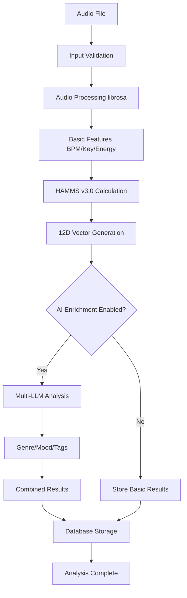

# Data Flow and Integration Patterns

## Overview
MAP4's data flow architecture orchestrates complex interactions between audio processing, HAMMS analysis, AI enrichment, and storage systems. Understanding these integration patterns is crucial for reproducing the system's sophisticated analysis pipeline.

## Primary Data Flow Pipeline

### Complete Analysis Workflow


### Enhanced Analyzer Integration (`src/services/enhanced_analyzer.py`)
```python
def analyze_track(self, track_path: str, force_reanalysis: bool = False, 
                 llm_progress_callback: Optional[callable] = None) -> EnhancedAnalysisResult:
    """Complete analysis pipeline integration"""
    
    # Stage 1: Input validation and metadata extraction
    metadata = self._get_track_metadata(track_path)
    
    # Stage 2: Audio processing (librosa pipeline)
    print(f"Analyzing track: {path_obj.name}")
    hamms_result = self.hamms_analyzer.analyze_track(track_path)
    
    # Stage 3: HAMMS v3.0 processing
    hamms_vector = hamms_result.get('hamms_vector', [0.0] * 12)
    hamms_confidence = hamms_result.get('confidence', 0.0)
    hamms_dimensions = hamms_result.get('dimensions', {})
    
    # Stage 4: AI enrichment (if enabled)
    if self.enable_ai and self.ai_enricher is not None:
        ai_result = self._perform_ai_analysis(hamms_result, llm_progress_callback)
        # Update result with AI data
        result.genre = ai_result.get('genre')
        result.subgenre = ai_result.get('subgenre')
        # ... etc
    
    # Stage 5: Database storage
    self._store_analysis_results(result)
    
    return result
```

## Audio Processing Integration

### From Raw Audio to HAMMS Foundation
```python
# Audio Processing → HAMMS Integration
def integrate_audio_hamms_pipeline(track_path: str) -> Dict[str, Any]:
    """Integration between audio processing and HAMMS systems"""
    
    # 1. Audio processing extracts basic features
    from src.lib.audio_processing import analyze_track
    audio_result = analyze_track(track_path)
    
    # 2. HAMMS analyzer uses audio features as foundation
    from src.analysis.hamms_v3 import HAMMSAnalyzerV3
    hamms_analyzer = HAMMSAnalyzerV3()
    
    # 3. Create enhanced track data for HAMMS calculation
    track_data = {
        'bpm': audio_result.get('bmp', 120.0),
        'key': audio_result.get('key', 'Am'), 
        'energy': audio_result.get('energy', 0.5),
        'genre': '',  # Will be filled by AI if available
        'title': Path(track_path).stem,
        'artist': 'Unknown'
    }
    
    # 4. Calculate 12-dimensional HAMMS vector
    hamms_vector = hamms_analyzer.calculate_extended_vector(track_data)
    
    # 5. Combine all results
    return {
        'audio_features': audio_result,
        'hamms_vector': hamms_vector.tolist(),
        'hamms_dimensions': dict(zip(hamms_analyzer.DIMENSION_NAMES, hamms_vector))
    }
```

### Progress Reporting Integration
```python
# Progress callback system integration across components
class AnalysisProgressTracker:
    """Tracks progress across multi-stage analysis"""
    
    def __init__(self, total_stages: int = 5):
        self.total_stages = total_stages
        self.current_stage = 0
        self.stage_progress = 0.0
        
    def update_stage(self, stage: AnalysisStage, progress: float, message: str):
        """Update progress with stage information"""
        self.current_stage = list(AnalysisStage).index(stage)
        self.stage_progress = progress
        
        # Calculate overall progress
        overall_progress = (self.current_stage + progress) / self.total_stages
        
        # Emit to UI or logging system
        self.emit_progress(overall_progress, message)
    
    def emit_progress(self, overall_progress: float, message: str):
        """Emit progress to connected systems"""
        # CLI progress bar
        if hasattr(self, 'cli_callback'):
            self.cli_callback(overall_progress, message)
        
        # GUI progress updates
        if hasattr(self, 'gui_callback'):
            self.gui_callback(overall_progress, message)
        
        # Logging system
        logger.info(f"Analysis progress: {overall_progress:.1%} - {message}")
```

## HAMMS to AI Enrichment Integration

### Multi-LLM Enricher Data Flow
```python
def _perform_ai_analysis(self, hamms_result: Dict[str, Any], 
                       progress_callback: Optional[callable] = None) -> Dict[str, Any]:
    """Bridge HAMMS results to AI analysis"""
    
    # 1. Prepare track data with HAMMS context
    track_data = {
        'hamms_vector': hamms_result.get('hamms_vector', [0.0] * 12),
        'bmp': hamms_result.get('bpm', 0),
        'key': hamms_result.get('key', 'Unknown'),
        'energy': hamms_result.get('energy', 0.0),
        'title': hamms_result.get('title', 'Unknown'),
        'artist': hamms_result.get('artist', 'Unknown'),
        'hamms_dimensions': hamms_result.get('dimensions', {})
    }
    
    # 2. Multi-LLM enrichment with context
    enrichment_result = self.ai_enricher.analyze_track(track_data, progress_callback)
    
    # 3. Validate and transform AI results
    if not enrichment_result.success:
        raise RuntimeError(f"AI analysis failed: {enrichment_result.error_message}")
    
    # 4. Return standardized AI result format
    return {
        'genre': enrichment_result.genre,
        'subgenre': enrichment_result.subgenre,
        'mood': enrichment_result.mood,
        'era': enrichment_result.era,
        'tags': enrichment_result.tags,
        'confidence': enrichment_result.ai_confidence,
        'provider': enrichment_result.provider,
        'processing_time_ms': enrichment_result.processing_time_ms,
        'cost_estimate': enrichment_result.cost_estimate
    }
```

### LLM Provider Selection Integration
```python
class IntelligentProviderSelector:
    """Selects optimal LLM provider based on track characteristics"""
    
    def select_provider(self, track_data: Dict[str, Any]) -> str:
        """Select best provider based on track complexity and cost"""
        
        # Calculate track complexity from HAMMS data
        complexity = self._calculate_track_complexity(track_data)
        
        # Get available providers with cost estimates
        providers = self.get_available_providers()
        
        # Selection strategy
        if complexity > 0.8:
            # Complex tracks (jazz, classical, experimental)
            # Need highest accuracy providers
            if "anthropic" in providers:
                return "anthropic"  # Claude 3 Opus
            elif "openai" in providers:
                return "openai"     # GPT-4
        
        elif complexity > 0.5:
            # Medium complexity tracks
            # Balance cost and accuracy
            if "anthropic" in providers:
                return "anthropic"  # Claude 3 Sonnet
            elif "gemini" in providers:
                return "gemini"     # Gemini 1.5 Pro
        
        else:
            # Simple tracks (pop, electronic)
            # Optimize for cost
            if "openai" in providers:
                return "openai"     # GPT-4o-mini
            elif "gemini" in providers:
                return "gemini"     # Gemini 1.5 Flash
        
        # Fallback to preferred provider
        return self.preferred_provider
    
    def _calculate_track_complexity(self, track_data: Dict[str, Any]) -> float:
        """Calculate track complexity from HAMMS and metadata"""
        hamms_vector = track_data.get('hamms_vector', [0.0] * 12)
        
        # Complexity indicators
        harmonic_complexity = hamms_vector[10] if len(hamms_vector) > 10 else 0.5  # HAMMS dimension 10
        rhythmic_complexity = hamms_vector[7] if len(hamms_vector) > 7 else 0.5    # HAMMS dimension 7
        
        # Genre-based complexity
        genre_complexity = 0.5
        title = track_data.get('title', '').lower()
        if any(word in title for word in ['jazz', 'classical', 'prog', 'experimental']):
            genre_complexity = 0.9
        elif any(word in title for word in ['pop', 'house', 'techno', 'edm']):
            genre_complexity = 0.3
        
        # Combined complexity score
        return (harmonic_complexity * 0.4 + rhythmic_complexity * 0.3 + genre_complexity * 0.3)
```

## Database Storage Integration

### Multi-Table Storage Strategy
```python
def _store_analysis_results(self, result: EnhancedAnalysisResult) -> None:
    """Store results across multiple related tables"""
    
    try:
        with self.storage.session() as session:
            # 1. Get or create track record
            track = self.storage.get_track_by_path(result.track_path)
            if not track:
                track = self.storage.upsert_track(result.track_path)
            
            # 2. Store HAMMS Advanced analysis
            hamms_record = HAMMSAdvanced()
            hamms_record.track_id = track.id
            hamms_record.set_vector_12d(result.hamms_vector)
            hamms_record.set_dimension_scores(result.hamms_dimensions)
            hamms_record.ml_confidence = result.hamms_confidence
            
            # Update existing or create new HAMMS record
            existing_hamms = session.query(HAMMSAdvanced).filter_by(track_id=track.id).first()
            if existing_hamms:
                existing_hamms.set_vector_12d(result.hamms_vector)
                existing_hamms.set_dimension_scores(result.hamms_dimensions)
                existing_hamms.ml_confidence = result.hamms_confidence
            else:
                session.add(hamms_record)
            
            # 3. Store AI analysis if available
            if result.genre is not None:
                ai_response_data = {
                    'genre': result.genre,
                    'subgenre': result.subgenre,
                    'mood': result.mood,
                    'era': result.era,
                    'tags': result.tags,
                    'confidence': result.ai_confidence
                }
                
                ai_record = AIAnalysis.from_llm_response(
                    track_id=track.id,
                    response_data=ai_response_data,
                    processing_time_ms=result.processing_time_ms
                )
                
                # Update existing or create new AI record
                existing_ai = session.query(AIAnalysis).filter_by(track_id=track.id).first()
                if existing_ai:
                    existing_ai.genre = result.genre
                    existing_ai.subgenre = result.subgenre
                    existing_ai.mood = result.mood
                    existing_ai.era = result.era
                    existing_ai.set_tags(result.tags)
                    existing_ai.ai_confidence = result.ai_confidence
                else:
                    session.add(ai_record)
            
            session.commit()
            
            # 4. Write metadata to audio file (post-database success)
            if result.success and result.genre is not None:
                self._write_metadata_to_file(result)
                
    except Exception as e:
        logger.warning(f"Failed to store analysis results: {e}")
        # Don't raise - allow analysis to complete even if storage fails
```

### Metadata File Integration
```python
def _write_metadata_to_file(self, result: EnhancedAnalysisResult) -> None:
    """Write analysis results back to audio file metadata"""
    
    try:
        # Import metadata writer
        from src.services.metadata_writer import metadata_writer
        
        # Prepare metadata for file writing
        metadata = {
            'genre': result.genre,
            'subgenre': result.subgenre,
            'mood': result.mood,
            'era': result.era,
            'tags': ', '.join(result.tags) if result.tags else None
        }
        
        # Remove None values
        metadata = {k: v for k, v in metadata.items() if v is not None}
        
        if metadata:
            success = metadata_writer.write_analysis_to_file(result.track_path, metadata)
            if success:
                logger.info(f"Metadata written to file: {Path(result.track_path).name}")
            else:
                logger.warning(f"Failed to write metadata to: {Path(result.track_path).name}")
                
    except Exception as e:
        logger.warning(f"Error writing metadata to {result.track_path}: {str(e)}")
        # Don't raise - metadata writing failure shouldn't stop analysis
```

## Compatibility Scoring Integration

### HAMMS-Based Compatibility Pipeline
```python
def calculate_track_compatibility(seed_track: Dict, candidate_tracks: List[Dict]) -> List[Tuple[float, Dict]]:
    """Calculate compatibility using integrated HAMMS and traditional DJ metrics"""
    
    from src.services.compatibility import suggest_compatible, transition_score
    from src.analysis.hamms_v3 import HAMMSAnalyzerV3
    
    hamms_analyzer = HAMMSAnalyzerV3()
    
    # Get seed track HAMMS vector
    seed_hamms = seed_track.get('hamms', [0.0] * 12)
    seed_vector = np.array(seed_hamms, dtype=np.float64)
    
    scored_candidates = []
    
    for candidate in candidate_tracks:
        # Calculate traditional compatibility score
        traditional_score = transition_score(seed_track, candidate)
        
        # Calculate HAMMS similarity
        candidate_hamms = candidate.get('hamms', [0.0] * 12)
        candidate_vector = np.array(candidate_hamms, dtype=np.float64)
        
        hamms_similarity = hamms_analyzer.calculate_similarity(seed_vector, candidate_vector)
        
        # Combined compatibility score
        # Weight: 60% traditional DJ metrics, 40% HAMMS similarity
        combined_score = (traditional_score * 0.6) + (hamms_similarity['overall'] * 0.4)
        
        scored_candidates.append((combined_score, candidate))
    
    # Sort by compatibility score (highest first)
    scored_candidates.sort(key=lambda x: x[0], reverse=True)
    
    return scored_candidates
```

### Playlist Generation Integration
```python
class IntegratedPlaylistGenerator:
    """Generate playlists using combined HAMMS and traditional compatibility"""
    
    def __init__(self, storage: Storage):
        self.storage = storage
        self.hamms_analyzer = HAMMSAnalyzerV3()
        
    def generate_playlist(self, seed_track_path: str, length: int = 10, 
                         compatibility_threshold: float = 0.7) -> List[Dict[str, Any]]:
        """Generate playlist using integrated analysis"""
        
        # Get all tracks from database
        all_tracks = self.storage.list_all_analyses()
        
        # Find seed track
        seed_track = next((t for t in all_tracks if t['path'] == seed_track_path), None)
        if not seed_track:
            raise ValueError(f"Seed track not found: {seed_track_path}")
        
        # Remove seed from candidates
        candidates = [t for t in all_tracks if t['path'] != seed_track_path]
        
        playlist = [seed_track]
        current_track = seed_track
        
        while len(playlist) < length and candidates:
            # Calculate compatibility with current track
            compatible_tracks = calculate_track_compatibility(current_track, candidates)
            
            # Filter by threshold and get best match
            best_matches = [
                (score, track) for score, track in compatible_tracks 
                if score >= compatibility_threshold
            ]
            
            if not best_matches:
                # Lower threshold if no matches found
                compatibility_threshold *= 0.9
                continue
            
            # Select best match
            next_score, next_track = best_matches[0]
            playlist.append(next_track)
            
            # Update for next iteration
            current_track = next_track
            candidates = [t for t in candidates if t['path'] != next_track['path']]
        
        return playlist
```

## CLI to GUI Integration

### Unified CLI Architecture Integration
```python
# CLI commands use the same enhanced analyzer as GUI
@click.command()
@click.argument('input_path', type=click.Path(exists=True))
@click.option('--output', '-o', type=click.Path(), help='Output file for results')
@click.option('--force', is_flag=True, help='Force re-analysis of existing tracks')
@click.option('--ai/--no-ai', default=True, help='Enable/disable AI enrichment')
def analyze_track(input_path: str, output: str, force: bool, ai: bool):
    """Analyze single track or directory of tracks"""
    
    # Use same enhanced analyzer as GUI
    storage = Storage.from_path("data/music.db")
    analyzer = EnhancedAnalyzer(storage, enable_ai=ai, skip_validation=True)
    
    if os.path.isfile(input_path):
        # Single track analysis
        result = analyzer.analyze_track(input_path, force_reanalysis=force)
        
        if output:
            write_results_to_file([result], output)
        else:
            display_single_result(result)
    
    elif os.path.isdir(input_path):
        # Directory analysis
        audio_files = find_audio_files(input_path)
        results = analyzer.batch_analyze(audio_files, force_reanalysis=force)
        
        if output:
            write_results_to_file(results, output)
        else:
            display_batch_results(results)
```

### GUI Integration with Worker Threads
```python
class EnhancedAnalyzeWorker(QThread):
    """Worker thread for enhanced music analysis"""
    
    progress = pyqtSignal(int, int)  # current, total
    track_analyzed = pyqtSignal(str, dict)  # track_path, analysis_data
    llm_progress = pyqtSignal(str, str, str)  # track_path, provider, status
    done = pyqtSignal(list)  # List[EnhancedAnalysisResult]
    error = pyqtSignal(str)
    
    def run(self):
        """Run enhanced analysis with progress reporting"""
        try:
            results = []
            total = len(self.track_paths)
            
            for i, track_path in enumerate(self.track_paths, 1):
                if self._stop_requested:
                    break
                
                # Progress callback for LLM updates
                def llm_callback(provider: str, status: str):
                    self.llm_progress.emit(track_path, provider, status)
                
                # Perform analysis using same enhanced analyzer
                result = self.analyzer.analyze_track(
                    track_path,
                    force_reanalysis=self.settings.force_reanalysis,
                    llm_progress_callback=llm_callback
                )
                
                results.append(result)
                
                if result.success:
                    # Emit data for UI updates (radar chart, etc.)
                    self.track_analyzed.emit(track_path, {
                        'hamms_vector': result.hamms_vector,
                        'genre': result.genre,
                        'mood': result.mood,
                        'confidence': result.hamms_confidence
                    })
                
                self.progress.emit(i, total)
            
            self.done.emit(results)
            
        except Exception as e:
            self.error.emit(f"Analysis failed: {str(e)}")
```

## Configuration Integration

### Unified Configuration System
```python
def load_integrated_config() -> Dict[str, Any]:
    """Load configuration that affects all integration points"""
    
    from src.config import get_config
    config = get_config()
    
    # Extract integration-relevant settings
    integration_config = {
        # LLM Provider settings
        'preferred_llm_provider': config.get('cli.default_provider', 'anthropic'),
        'enable_ai_enrichment': config.get('analysis.enable_ai', True),
        'llm_fallback_enabled': config.get('providers.enable_fallback', True),
        
        # Analysis pipeline settings  
        'hamms_cache_size': config.get('analysis.hamms_cache_size', 1000),
        'batch_size': config.get('analysis.batch_size', 10),
        'retry_attempts': config.get('analysis.retry_attempts', 3),
        
        # Storage settings
        'database_path': config.get('storage.database_path', 'data/music.db'),
        'backup_enabled': config.get('storage.backup_enabled', True),
        'cache_results': config.get('analysis.cache_results', True),
        
        # Performance settings
        'max_concurrent_analyses': config.get('analysis.max_concurrent', 5),
        'progress_reporting_enabled': config.get('ui.enable_progress', True),
        'metadata_writing_enabled': config.get('analysis.write_metadata', True),
        
        # Quality gates
        'enable_validation': config.get('analysis.enable_validation', False),
        'min_confidence_threshold': config.get('analysis.min_confidence', 0.5)
    }
    
    return integration_config
```

## Error Handling Integration

### Cascade Error Recovery
```python
class IntegratedErrorHandler:
    """Handle errors across the entire analysis pipeline"""
    
    def __init__(self):
        self.error_counts = defaultdict(int)
        self.recovery_strategies = {
            'audio_processing_error': self._handle_audio_error,
            'hamms_calculation_error': self._handle_hamms_error,
            'ai_enrichment_error': self._handle_ai_error,
            'storage_error': self._handle_storage_error
        }
    
    def handle_analysis_error(self, error: Exception, context: Dict[str, Any]) -> bool:
        """Handle analysis errors with appropriate recovery strategy"""
        
        error_type = self._classify_error(error, context)
        self.error_counts[error_type] += 1
        
        # Get recovery strategy
        recovery_func = self.recovery_strategies.get(error_type, self._default_recovery)
        
        try:
            return recovery_func(error, context)
        except Exception as recovery_error:
            logger.error(f"Recovery strategy failed: {recovery_error}")
            return False
    
    def _handle_audio_error(self, error: Exception, context: Dict[str, Any]) -> bool:
        """Handle audio processing errors"""
        track_path = context.get('track_path')
        
        # Try alternative audio loading strategies
        alternatives = [
            lambda: self._try_reduced_quality_loading(track_path),
            lambda: self._try_metadata_only_analysis(track_path),
            lambda: self._create_fallback_analysis(track_path)
        ]
        
        for alternative in alternatives:
            try:
                result = alternative()
                context['recovery_result'] = result
                return True
            except Exception:
                continue
        
        return False
    
    def _handle_ai_error(self, error: Exception, context: Dict[str, Any]) -> bool:
        """Handle AI enrichment errors with provider fallback"""
        
        # Get current provider from context
        current_provider = context.get('ai_provider')
        
        # Try fallback providers
        from src.analysis.multi_llm_enricher import MultiLLMEnricher
        enricher = MultiLLMEnricher()
        
        for provider in enricher.get_available_providers():
            if provider != current_provider:
                try:
                    # Attempt analysis with fallback provider
                    track_data = context.get('track_data', {})
                    result = enricher.analyze_with_provider(track_data, provider)
                    context['recovery_result'] = result
                    return True
                except Exception:
                    continue
        
        # If all providers fail, continue without AI enrichment
        context['ai_enrichment_disabled'] = True
        return True
```

## Performance Integration

### Resource Management Across Components
```python
class ResourceManager:
    """Manage resources across all analysis components"""
    
    def __init__(self):
        self.active_analyses = 0
        self.max_concurrent = 5
        self.memory_threshold = 0.8  # 80% memory usage
        self.provider_rate_limits = {}
    
    def can_start_analysis(self) -> bool:
        """Check if system can handle another analysis"""
        
        # Check concurrent analysis limit
        if self.active_analyses >= self.max_concurrent:
            return False
        
        # Check memory usage
        import psutil
        if psutil.virtual_memory().percent / 100 > self.memory_threshold:
            return False
        
        # Check provider rate limits
        for provider, last_call in self.provider_rate_limits.items():
            if time.time() - last_call < 1.0:  # 1 second minimum between calls
                return False
        
        return True
    
    def acquire_resources(self, analysis_type: str) -> bool:
        """Acquire resources for analysis"""
        
        if not self.can_start_analysis():
            return False
        
        self.active_analyses += 1
        return True
    
    def release_resources(self, analysis_type: str):
        """Release resources after analysis completion"""
        self.active_analyses = max(0, self.active_analyses - 1)
```

This comprehensive data flow and integration architecture enables MAP4 to seamlessly orchestrate complex music analysis workflows while maintaining robustness, performance, and extensibility across all system components. The integration patterns ensure that each component can operate independently while contributing to the overall analysis quality and user experience.